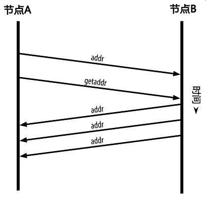
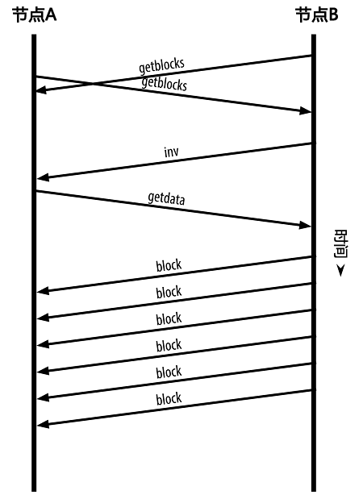
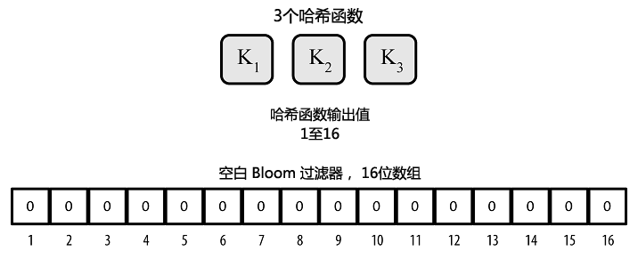
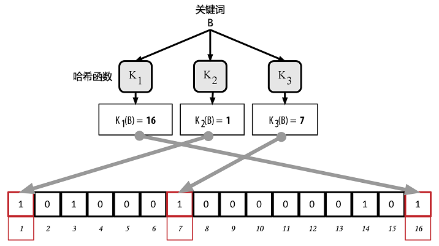

# 第6章 比特币网络

## 6.1 P2P网络架构

比特币采用了基于国际互联网（Internet）的P2P（peer-to-peer）网络架构。P2P是指位于同一网络中的每台计算机都彼此对等，各个节点共同提供网络服务，不存在任何“特殊”节点。每个网络节点以“扁平（flat）”的拓扑结构相互连通。在P2P网络中不存在任何服务端（server）、中央化的服务、以及层级结构。P2P网络的节点之间交互运作、协同处理：每个节点在对外提供服务的同时也使用网络中其他节点所提供的服务。P2P网络也因此具有可靠性、去中心化，以及开放性。早期的国际互联网就是P2P网络架构的一个典型用例：IP网络中的各个节点完全平等。当今的互联网架构具有分层架构，但是IP协议仍然保留了扁平拓扑的结构。在比特币之外，规模最大也最成功的P2P技术应用是在文件分享领域：Napster是该领域的先锋，BitTorrent是其架构的最新演变。

比特币所采用的P2P网络架构不仅仅是选择拓扑结构这样简单。比特币被设计为一种点对点的数字现金系统，它的网络架构既是这种核心特性的反映，也是该特性的基石。去中心化控制是设计时的核心原则，它只能通过维持一种扁平化、去中心化的P2P共识网络来实现。

“比特币网络”是按照比特币P2P协议运行的一系列节点的集合。除了比特币P2P协议之外，比特币网络中也包含其他协议。例如Stratum协议就被应用于挖矿、以及轻量级或移动端比特币钱包之中。网关（gateway）路由服务器提供这些协议，使用比特币P2P协议接入比特币网络，并把网络拓展到运行其他协议的各个节点。例如，Stratum服务器通过Stratum协议将所有的Stratum挖矿节点连接至比特币主网络、并将Stratum协议桥接（bridge）至比特币P2P协议之上。我们使用“扩展比特币网络（extended bitcoin network）”指代所有包含比特币P2P协议、矿池挖矿协议、Stratum协议以及其他连接比特币系统组件相关协议的整体网络结构。

## 6.2 节点类型及分工

尽管比特币P2P网络中的各个节点相互对等，但是根据所提供的功能不同，各节点可能具有不同的分工。每个比特币节点都是路由、区块链数据库、挖矿、钱包服务的功能集合。一个全节点（full node）包括如图6-1所示的四个功能：

>  
<br> 图6-1 一个包含四个完整功能的比特币网络节点：钱包、矿工、完整区块链、网络路由节点 

每个节点都参与全网络的路由功能，同时也可能包含其他功能。每个节点都参与验证并传播交易及区块信息，发现并维持与对等节点的连接。在图6-1所示的全节点用例中，名为“网络路由节点”的橙色圆圈即表示该路由功能。

一些节点保有一份完整的、最新的区块链拷贝，这样的节点被称为“全节点”。全节点能够独立自主地校验所有交易，而不需借由任何外部参照。另外还有一些节点只保留了区块链的一部分，它们通过一种名为“简易支付验证（SPV）”的方式来完成交易验证。这样的节点被称为“SPV节点”，又叫“轻量级节点”。在如上图所示的全节点用例中，名为完整区块链的蓝色圆圈即表示了全节点区块链数据库功能。在图6-3中，SPV节点没有此蓝色圆圈，以示它们没有区块链的完整拷贝。

挖矿节点通过运行在特殊硬件设备上的工作量证明（proof-of-work）算法，以相互竞争的方式创建新的区块。一些挖矿节点同时也是全节点，保有区块链的完整拷贝；还有一些参与矿池挖矿的节点是轻量级节点，它们必须依赖矿池服务器维护的全节点进行工作。在全节点用例中，挖矿功能如图中名为“矿工”的黑色圆圈所示。

用户钱包也可以作为全节点的一部分，这在桌面比特币客户端中比较常见。当前，越来越多的用户钱包都是SPV节点，尤其是运行于诸如智能手机等资源受限设备上的比特币钱包应用；而这正变得越来越普遍。在图6-1中，名为“钱包”的绿色圆圈代表钱包功能。

在比特币P2P协议中，除了这些主要的节点类型之外，还有一些服务器及节点也在运行着其他协议，例如特殊矿池挖矿协议、轻量级客户端访问协议等。

图6-2描述了扩展比特币网络中最为常见的节点类型。

>  
<br> 图6-2 扩展比特币网络的不同节点类型

## 6.3 扩展比特币网络

运行比特币P2P协议的比特币主网络由大约7000-10000个运行着不同版本比特币核心客户端（Bitcoin Core）的监听节点、以及几百个运行着各类比特币P2P协议的应用（例如BitcoinJ、Libbitcoin、btcd等）的节点组成。比特币P2P网络中的一小部分节点也是挖矿节点，它们竞争挖矿、验证交易、并创建新的区块。许多连接到比特币网络的大型公司运行着基于Bitcoin核心客户端的全节点客户端，它们具有区块链的完整拷贝及网络节点，但不具备挖矿及钱包功能。这些节点是网络中的边缘路由器（edge routers），通过它们可以搭建其他服务，例如交易所、钱包、区块浏览器、商家支付处理（merchant payment processing）等。

如前文所述，扩展比特币网络既包括了运行比特币P2P协议的网络，又包含运行特殊协议的网络节点。比特币P2P主网络上连接着许多矿池服务器以及协议网关，它们把运行其他协议的节点连接起来。这些节点通常都是矿池挖矿节点（参见第8章）以及轻量级钱包客户端，它们通常不具备区块链的完整备份。

图6-3描述了扩展比特币网络，它包括了多种类型的节点、网关服务器、边缘路由器、钱包客户端以及它们相互连接所需的各类协议。

>  
<br> 图6-3 具有多种节点类型、网关及协议的扩展比特币网络

## 6.4 网络发现

当新的网络节点启动后，为了能够参与协同运作，它必须发现网络中的其他比特币节点。新的网络节点必须发现至少一个网络中存在的节点并建立连接。由于比特币网络的拓扑结构并不基于节点间的地理位置，因此各个节点之间的地理信息完全无关。在新节点连接时，可以随机选择网络中存在的比特币节点与之相连。

节点通常采用TCP协议、使用8333端口（该端口号通常是比特币所使用的，除8333端口外也可以指定使用其他端口）与已知的对等节点建立连接。在建立连接时，该节点会通过发送一条包含基本认证内容的version消息开始“握手”通信过程(见图6-4)。这一过程包括如下内容：

▷ **PROTOCOL_VERSION**
<br>常量，定义了客户端所“说出”的比特币P2P协议所采用的版本（例如：70002）。

▷ **nLocalServices**
<br>一组该节点支持的本地服务列表，当前仅支持NODE_NETWORK

▷ **nTime**
<br>当前时间

▷ **addrYou**
<br>当前节点可见的远程节点的IP地址

▷ **addrMe**
<br>本地节点所发现的本机IP地址

▷ **subver**
<br>指示当前节点运行的软件类型的子版本号（例如：”/Satoshi:0.9.2.1/”）

▷ **BaseHeight**
<br>当前节点区块链的区块高度
<br>（version网络消息的具体用例请参见[GitHub](http://bit.ly/1qlsC7w)）

网络中的对等节点通过对verack消息的响应进行确认并建立连接；有时候，如果接收节点需要互换连接并连回起始节点，也会传回该对等节点的version消息。

新节点是如何发现网络中的对等节点的呢？虽然比特币网络中没有特殊节点，但是客户端会维持一个列表，那里列出了那些长期稳定运行的节点。这样的节点被称为“种子节点（seed nodes）”。新节点并不一定需要与种子节点建立连接，但连接到种子节点的好处是可以通过种子节点来快速发现网络中的其他节点。在比特币核心客户端中，是否使用种子节点是通过“-dnsseed”控制的。默认情况下，该选项设为1，即意味着使用种子节点。另一种方式是，起始时将至少一个比特币节点的IP地址提供给正在启动的节点（该节点不包含任何比特币网络的组成信息）。在这之后，启动节点可以通过后续指令建立新的连接。用户可以使用命令行参数“-seednode”把启动节点“引荐”并连接到一个节点，并将该节点用作DNS种子。在初始种子节点被用于形成“引荐”信息之后，客户端会断开与它的连接、并与新发现的对等节点进行通信。

>  
<br> 图6-4 对等节点之间的初始“握手”通信

当建立一个或多个连接后，新节点将一条包含自身IP地址的addr消息发送给其相邻节点。相邻节点再将此条addr消息依次转发给它们各自的相邻节点，从而保证新节点信息被多个节点所接收、保证连接更稳定。另外，新接入的节点可以向它的相邻节点发送getaddr消息，要求它们返回其已知对等节点的IP地址列表。通过这种方式，节点可以找到需连接到的对等节点，并向网络发布它的消息以便其他节点查找。图6-5描述了这种地址发现协议。

>  
<br> 图6-5 地址广播及发现

节点必须连接到若干不同的对等节点才能在比特币网络中建立通向比特币网络的种类各异的路径（path）。由于节点可以随时加入和离开，通讯路径是不可靠的。因此，节点必须持续进行两项工作：在失去已有连接时发现新节点，并在其他节点启动时为其提供帮助。节点启动时只需要一个连接，因为第一个节点可以将它引荐给它的对等节点，而这些节点又会进一步提供引荐。一个节点，如果连接到大量的其他对等节点，这既没必要，也是对网络资源的浪费。在启动完成后，节点会记住它最近成功连接的对等节点；因此，当重新启动后它可以迅速与先前的对等节点网络重新建立连接。如果先前的网络的对等节点对连接请求无应答，该节点可以使用种子节点进行重启动。

在运行比特币核心客户端的节点上，您可以使用`getpeerinfo`命令列出对等节点连接信息：

```
$ bitcoin-cli getpeerinfo
[
    {
        "addr" : "85.213.199.39:8333",
        "services" : "00000001",
        "lastsend" : 1405634126,
        "lastrecv" : 1405634127,
        "bytessent" : 23487651,
        "bytesrecv" : 138679099,
        "conntime" : 1405021768,
        "pingtime" : 0.00000000,
        "version" : 70002,
        "subver" : "/Satoshi:0.9.2.1/",
        "inbound" : false,
        "startingheight" : 310131,
        "banscore" : 0,
        "syncnode" : true
    },
    {
        "addr" : "58.23.244.20:8333",
        "services" : "00000001",
        "lastsend" : 1405634127,
        "lastrecv" : 1405634124,
        "bytessent" : 4460918,
        "bytesrecv" : 8903575,
        "conntime" : 1405559628,
        "pingtime" : 0.00000000,
        "version" : 70001,
        "subver" : "/Satoshi:0.8.6/",
        "inbound" : false,
        "startingheight" : 311074,
        "banscore" : 0,
        "syncnode" : false
    }
]
```

用户可以通过提供`-connect=<IP地址>`选项来指定一个或多个IP地址，从而达到复写自动节点管理功能并指定IP地址列表的目的。如果采用此选项，节点只连接到这些选定的节点IP地址，而不会自动发现并维护对等节点之间的连接。

如果已建立的连接没有数据通信，所在的节点会定期发送信息以维持连接。如果节点持续某个连接长达90分钟没有任何通信，它会被认为已经从网络中断开，网络将开始查找一个新的对等节点。因此，比特币网络会随时根据变化的节点及网络问题进行动态调整，不需经过中心化的控制即可进行规模增、减的有机调整。

## 6.5 全节点

全节点是指维持包含全部交易信息的完整区块链的节点。更加准确地说，这样的节点应当被称为完整区块链节点”。在比特币发展的早期，所有节点都是全节点；当前的比特币核心客户端也是完整区块链节点。但在过去的两年中出现了许多新型客户端，它们不需要维持完整的区块链，而是作为轻量级客户端运行。在下面的章节里我们会对这些轻量级客户端进行详细介绍。

完整区块链节点保有完整的、最新的包含全部交易信息的比特币区块链拷贝，这样的节点可以独立地进行建立并校验区块链，从第一区块（创世区块）一直建立到网络中最新的区块。完整区块链节点可以独立自主地校验任何交易信息，而不需要借助任何其他节点或其他信息来源。完整区块节点通过比特币网络获取包含交易信息的新区块更新，在验证无误后将此更新合并至本地的区块链拷贝之中。

运行完整区块链节点可以给您一种纯粹的比特币体验：不需借助或信任其他系统即可独立地对所有交易信息进行验证。辨别您是否在运行全节点是十分容易的：只需要查看您的永久性存储设备（如硬盘）是否有超过20GB的空间被用来存储完整区块链即可。如果您需要很大的磁盘空间、并且同步比特币网络耗时2至3天，那么您使用的正是全节点。这就是摆脱中心化管理、获得完全的独立自由所要付出的代价。

尽管目前还有一些使用不同编程语言及软件架构的其他的完整区块链客户端存在，但是最常用的仍然是比特币核心客户端，它也被称为“Satoshi客户端”。比特币网络中超过90%的节点运行着各个版本的比特币核心客户端。如前文所述，它可以通过节点间发送的version消息或通过getpeerinfo命令所得到的子版本字符串“Satoshi”加以辨识，例如 /Satoshi: 0.8.6/。

## 6.6 交换“库存清单”

一个全节点连接到对等节点之后，第一件要做的事情就是构建完整的区块链。如果该节点是一个全新节点，那么它就不包含任何区块链信息，它只知道一个区块——静态植入在客户端软件中的创世区块。新节点需要下载从0号区块（创世区块）开始的数十万区块的全部内容，才能跟网络同步、并重建全区块链。

同步区块链的过程从发送version消息开始，这是因为该消息中含有的BestHeight字段标示了一个节点当前的区块链高度（区块数量）。节点可以从它的对等节点中得到版本消息，了解双方各自有多少区块，从而可以与其自身区块链所拥有的区块数量进行比较。对等节点们会交换一个getblocks消息，其中包含他们本地区块链的顶端区块哈希值。如果某个对等节点识别出它接收到的哈希值并不属于顶端区块，而是属于一个非顶端区块的旧区块，那么它就能推断出：其自身的本地区块链比其他对等节点的区块链更长。

拥有更长区块链的对等节点比其他节点有更多的区块，可以识别出哪些区块们是其他节点需要“补充”的。它会识别出第一批可供分享的500个区块，通过使用inv（inventory）消息把这些区块的哈希值传播出去。缺少这些区块的节点便可以通过各自发送的getdata消息来请求得到全区块信息，用包含在inv消息中的哈希值来确认是否为正确的被请求的区块，从而读取这些缺失的区块。

在下例中，我们假设某节点只含有创世区块。它收到了来自对等节点的inv消息，其中包含了区块链中后500个区块的哈希值。于是它开始向所有与之相连的对等节点请求区块，并通过分摊工作量的方式防止单一对等节点被批量请求所压垮。该节点会追踪记录其每个对等节点连接上“正在传输”（指那些它已经发出了请求但还没有接收到）的区块数量，并且检查该数量有没有超过上限（`MAX_BLOCKS_IN_TRANSIT_PER_PEER`）。用这种办法，如果一个节点需要更新大量区块，它会在上一请求完成后才发送对新区块的请求，从而允许对等节点控制更新速度，不至于压垮网络。每一个区块在被接收后就会被添加至区块链中，这一过程详见第7章。随着本地区块链的逐步建立，越来越多的区块被请求和接收，整个过程将一直持续到该节点与全网络完成同步为止。

每当一个节点离线，不管离线时间有多长，这个与对等节点比较本地区块链并恢复缺失区块的过程就会被触发。如果一个节点只离线几分钟，可能只会缺失几个区块；当它离线长达一个月，可能会缺失上千个区块。但无论哪种情况，它都会从发送`getblocks`消息开始，收到一个inv响应，接着开始下载缺失的区块库存清单和区块广播协议如图6-6所示。

>  
<br> 图6-6 节点通过从对等节点读取区块来同步区块链

## 6.7 简易支付验证 （SPV）节点  

并非所有的节点都有能力储存完整的区块链。许多比特币客户端被设计成运行在空间和功率受限的设备上，如智能电话、平板电脑、嵌入式系统等。对于这样的设备，通过简化的支付验证（SPV）的方式可以使它们在不必存储完整区块链的情况下进行工作。这种类型的客端被称为SPV客户端或轻量级客户端。随着比特币的使用热潮，SPV节点逐渐变成比特币节点（尤其是比特币钱包）所采用的最常见的形式。

SPV节点只需下载区块头，而不用下载包含在每个区块中的交易信息。由此产生的不含交易信息的区块链，大小只有完整区块链的1/1000。SPV节点不能构建所有可用于消费的UTXO的全貌，这是由于它们并不知道网络上所有交易的完整信息。SPV节点验证交易时所使用的方法略有不同，这个方法需依赖对等节点“按需”提供区块链相关部分的局部视图。

打个比方来说，每个全节点就像是一个在陌生城市里的游客，他带着一张包含每条街道、每个地址的详细地图。相比之下，SPV节点就像是这名陌生城市里的游客只知道一条主干道的名字，通过随机询问该城市的陌生人来获取分段道路指示。虽然两种游客都可以通过实地考察来验证一条街是否存在，但没有地图的游客不知道每个小巷中有哪些街道，也不知道附近还有什么其他街道。没有地图的游客在“教堂街23号”的前面，并不知道这个城市里是否还有其他若干条“教堂街23号”，也不知道面前的这个是否是要找的那个。对他来说，最好的方式就是向足够多的人问路，并且希望其中一部分人不是要试图抢劫他。

简易支付验证是通过参考交易在区块链中的深度，而不是高度，来验证它们。一个拥有完整区块链的节点会构造一条验证链，这条链是由沿着区块链按时间倒序一直追溯到创世区块的数千区块及交易组成。而一个SPV节点会验证所有区块的链（但不是所有的交易），并且把区块链和有关交易链接起来。

例如，一个全节点要检查第300,000号区块中的某个交易，它会把从该区块开始一直回溯到创世区块的300,000个区块全部都链接起来，并建立一个完整的UTXO数据库，通过确认该UTXO是否还未被支付来证实交易的有效性。SPV节点则不能验证UTXO是否还未被支付。相反地，SPV节点会在该交易信息和它所在区块之间用merkle路径（见164页“Merkle树”一节）建立一条链接。然后SPV节点一直等待，直到序号从300,001到300,006的六个区块堆叠在该交易所在的区块之上，并通过确立交易的深度是在第300,006区块~第300,001区块之下来验证交易的有效性。事实上，如果网络中的其他节点都接受了第300,000区块，并通过足够的工作在该块之上又生成了六个区块，根据代理网关协议，就可以证明该交易不是双重支付。

如果一个交易实际上不存在，SPV节点不会误认为该交易存在于某区块中。SPV节点会通过请求merkle路径证明以及验证区块链中的工作量证明，来证实交易的存在性。可是，一个交易的存在是可能对SPV节点“隐藏”的。SPV节点毫无疑问可以证实某个交易的存在性，但它不能验证某个交易（譬如同一个UTXO的双重支付）不存在，这是因为SPV节点没有一份关于所有交易的记录。这个漏洞会被针对SPV节点的拒绝服务攻击或双重支付型攻击所利用。为了防御这些攻击，SPV节点需要随机连接到多个节点，以增加与至少一个可靠节点相连接的概率。这种随机连接的需求意味着SPV节点也容易受到网络分区攻击或Sybil攻击。在后者情况中，SPV节点被连接到虚假节点或虚假网络中，没有通向可靠节点或真正的比特币网络的连接。

在绝大多数的实际情况中，具有良好连接的SPV节点是足够安全的，它在资源需求、实用性和安全性之间维持恰当的平衡。当然，如果要保证万无一失的安全性，最可靠的方法还是运行完整区块链的节点。

>  
<br>完整的区块链节点是通过检查整个链中在它之下的数千个区块来保证这个UTXO没有被支付，从而验证交易。而SPV节点是通过检查在其上面的区块将它压在下面的深度来验证交易。

SPV节点使用的是一条getheaders消息，而不是getblocks消息来获得区块头。发出响应的对等节点将用一条headers消息发送多达2000个区块头。这一过程和全节点获取所有区块的过程没什么区别。SPV节点还在与对等节点的连接上设置了过滤器，用以过滤从对等节点发来的未来区块和交易数据流。任何目标交易都是通过一条getdata的请求来读取的。对等节点生成一条包含交易信息的tx消息作为响应。区块头的同步过程如图6-7所示。

>  
<br> 图6-7 SPV节点同步区块头

由于SPV节点需要读取特定交易从而选择性地验证交易，这样就又产生了隐私风险。与全区块链节点收集每一个区块内的全部交易所不同的是，SPV节点对特定数据的请求可能无意中透露了钱包里的地址信息。例如，监控网络的第三方可以跟踪某个SPV节点上的钱包所请求的全部交易信息，并且利用这些交易信息把比特币地址和钱包的用户关联起来，从而损害了用户的隐私。

在引入SPV节点/轻量级节点后不久，比特币开发人员就添加了一个新功能：Bloom过滤器，用以解决SPV节点的隐私风险问题。Bloom过滤器通过一个采用概率而不是固定模式的过滤机制，允许SPV节点只接收交易信息的子集，同时不会精确泄露哪些是它们感兴趣的地址。

## 6.8 Bloom过滤器

Bloom过滤器是一个允许用户描述特定的关键词组合而不必精确表述的基于概率的过滤方法。它能让用户在有效搜索关键词的同时保护他们的隐私。在SPV节点里，这一方法被用来向对等节点发送交易信息查询请求，同时交易地址不会被暴露。

用我们之前的例子，一位手中没有地图的游客需要询问去特定地方的路线。如果他向陌生人询问“教堂街23号在哪里”，不经意之间，他就暴露了自己的目的地。Bloom过滤器则会这样问，附近有带‘堂’字的街道吗？”这样的问法包含了比之前略少的关键词。这位游客可以自己选择包含信息的多少，比如“以‘堂街’结尾”或者“‘教’字开头的街道”。如果他问得越少，得到了更多可能的地址，隐私得到了保护，但这些地址里面不乏无关的结果；如果他问得非常具体，他在得到较准确的结果的同时也暴露了自己的隐私。

Bloom过滤器可以让SPV节点指定交易的搜索模式，该搜索模式可以基于准确性或私密性的考虑被调节。一个非常具体的Bloom过滤器会生成更准确的结果，但也会显示该用户钱包里的使用的地址；反之，如果过滤器只包含简单的关键词，更多相应的交易会被搜索出来，在包含若干无关交易的同时有着更高的私密性。

首先，SPV节点会初始化一个不会匹配任何关键词的“空白”Bloom过滤器。接下来，SPV节点会创建一个包含钱包中所有地址信息的列表，并创建一个与每个地址相对应的交易输出相匹配的搜索模式。通常，这种搜索模式是一个向公钥付款的哈希脚本、，该脚本是一个会出现在每一个向公钥哈希地址付款的交易中的锁定脚本。如果SPV节点需要追踪P2SH地址余额，搜索模式就会变成P2SH脚本。然后，SPV节点会把每一个搜索模式添加至Bloom过滤器里，这样只要关键词出现在交易中就能够被过滤器识别出来。最后，对等节点会用收到的Bloom过滤器来匹配传送至SPV节点的交易。

Bloom过滤器的实现是由一个可变长度（N）的二进制数组（N位二进制数构成一个位域）和数量可变（M）的一组哈希函数组成。。这些哈希函数的输出值始终在1和N之间，该数值与二进制数组相对应。并且该函数为确定性函数，也就是说任何一个使用相同Bloom过滤器的节点通过该函数都能对特定输入得到同一个的结果。Bloom过滤器的准确性和私密性能通过改变长度（N）和哈希函数的数量（M）来调节。

在图6-8中，我们用一个小型的十六位数组和三个哈希函数来演示Bloom过滤器的应用原理。

>  
<br> 图6-8 一个由16位数组和三个哈希函数组成的简易Bloom过滤

Bloom过滤器数组里的每一个数的初始值为零。关键词被加到Bloom过滤器中之前，会依次通过每一个哈希函数运算一次。该输入经第一个哈希函数运算后得到了一个在1和N之间的数，它在该数组（编号依次为1至N）中所对应的位被置为1，从而把哈希函数的输出记录下来。接着再进行下一个哈希函数的运算，把另外一位置为1；以此类推。当全部M个哈希函数都运算过之后，一共有M个位的值从0变成了1，这个关键词也被“记录”在了Bloom过滤器里。

图6-9显示了向图6-8里的简易Bloom过滤器添加关键词“A”。

>  
<br> 图6-9 向简易Bloom过滤器中增加关键词“A”

增加第二个关键是就是简单地重复之前的步骤。关键词依次通过各哈希函数运算之后，相应的位变为1，Bloom过滤器则记录下该关键词。需要注意的是，当Bloom过滤器里的关键词增加时，它对应的某个哈希函数的输出值的位可能已经是1了，这种情况下，该位不会再次改变。也就是说，随着更多的关键词指向了重复的位，Bloom过滤器随着位1的增加而饱和，准确性也因此降低了。该过滤器之所以是基于概率的数据结构，就是因为关键词的增加会导致准确性的降低。准确性取决于关键字的数量以及数组大小（N）和哈希函数的多少（M）。更大的数组和更多的哈希函数会记录更多的关键词以提高准确性。而小的数组及有限的哈希函数只能记录有限的关键词从而降低准确性。

图6-10显示了向该简易Bloom过滤器里增加第二个关键词“B”。

>  
<br> 图6-10 向简易Bloom过滤器中增加第二个关键词“B”

为测试某一关键词是否被记录在某个Bloom过滤器中，我们将该关键词逐一代入各哈希函数中运算，并将所得的结果与原数组进行对比。如果所有的结果对应的位都变为了1，则表示这个关键词有可能已被该过滤器记录。之所以这一结论并不确定，是因为这些字节1也有可能是其他关键词运算的重叠结果。简单来说，Bloom过滤器正匹配代表着“可能是”。

图6-11是一个验证关键词“X”是否在前述Bloom过滤器中的图例。相应的比特位都被置为1，所以这个关键词很有可能是匹配的。

>  
<br> 图6-11 验证关键词“X”是否存在于Bloom过滤器中。若结果为或然正匹配，则表示“可能是”。

另一方面，如果我们代入关键词计算后的结果某位为0，说明该关键词并没有被记录在过滤器里。负匹配的结果不是可能，而是一定。也就是说，负匹配代表着“一定不是”。

图6-12是一个验证关键词“Y”是否存在于简易Bloom过滤器中的图例。图中某个结果字段为0，该字段一定没有被匹配。

>  
<br> 图6-12 验证关键词“Y”是否存在于Bloom过滤器中。若结果为必然负匹配，则表示“一定不是”。

BIP0037里已经对Bloom过滤器的实现有所描述。请参见附录2或访问[GitHub](https://github.com/bitcoin/bips/blob/master/bip-0037.mediawiki)。

## 6.9 Bloom过滤器和存货更新

Bloom过滤器被用来过滤SPV节点从对等节点里收到的交易信息。SPV会建立一个只能和SPV节点钱包里的地址匹配的过滤器。随后，SPV节点会向对等节点发送一条包含需在该连接中使用的过滤器的filterload消息。当过滤器建好之后，对等节点将每个交易的输出值代入过滤器中验证。那些正匹配的交易会被传送回SPV节点。

为回应来自SPV节点的getdata信息，对等节点会发出一条只含有和过滤器匹配的区块的区块头信息，以及与之相匹配的交易的merkle树（参见164页的“Merkle树”一节）。这一对等节点还会发出一条相匹配的交易的tx消息。

这个节点能够通过发送一条filteradd信息来向它的Bloom过滤器增加关键词，也能够发送filterclear信息来清除整个过滤器。因为不能直接从过滤器里删除关键词，所以如果某关键词不再需要，节点必须通过清除和增加来替换原有的过滤器。

## 6.10 交易池
比特币网络中几乎每个节点都会维护一份未确认交易的临时列表，被称为内存池或交易池。节点们利用这个池来追踪记录那些被网络所知晓、但还未被区块链所包含的交易。例如，保存用户钱包的节点会利用这个交易池来记录那些网络已经接收但还未被确认的、属于该用户钱包的预支付信息。

随着交易被接收和验证，它们被添加到交易池并通知到相邻节点处，从而传播到网络中。

有些节点的实现还维护一个单独的孤立交易池。如果一个交易的输入与某未知的交易有关，如与缺失的父交易相关，该孤立交易就会被暂时储存在孤立交易池中直到父交易的信息到达。

当一个交易被添加到交易池中，会同时检查孤立交易池，看是否有某个孤立交易引用了此交易的输出（子交易）。任何匹配的孤立交易会被进行验证。如果验证有效，它们会从孤立交易池中删除，并添加到交易池中，使以其父交易开始的链变得完整。对新加入交易池的交易来说，它不再是孤立交易。前述过程重复递归寻找进一步的后代，直至所有的后代都被找到。通过这一过程，一个父交易的到达把整条链中的孤立交易和它们的父级交易重新结合在一起，从而触发了整条独立交易链进行级联重构。

交易池和孤立交易池（如有实施）都是存储在本地内存中，并不是存储在永久性存储设备（如硬盘）里。更准确的说，它们是随网络传入的消息动态填充的。节点启动时，两个池都是空闲的；随着网络中新交易不断被接收，两个池逐渐被填充。

有些比特币客户端的实现还维护一个UTXO数据库，也称UTXO池，是区块链中所有未支付交易输出的集合。“UTXO池”的名字听上去与交易池相似，但它代表了不同的数据集。UTXO池不同于交易池和孤立交易池的地方在于，它在初始化时不为空，而是包含了数以百万计的未支付交易输出条目，有些条目的历史甚至可以追溯至2009年。UTXO池可能会被安置在本地内存，或者作为一个包含索引的数据库表安置在永久性存储设备中。

交易池和孤立交易池代表的是单个节点的本地视角。取决于节点的启动时间或重启时间，不同节点的两池内容可能有很大差别。相反地，UTXO池代表的是网络的突显共识，因此，不同节点间UTXO池的内容差别不大。此外，交易池和孤立交易池只包含未确认交易，而UTXO池之只包含已确认交易。

## 6.11 警告消息
警告消息并不经常使用，但在大多数节点上都有此功能。警告消息是比特币的“紧急广播系统”，比特币核心开发人员可以借此功能给所有比特币节点发送紧急文本消息。这一功能是为了让核心开发团队将比特币网络的严重问题通知所有的比特币用户，例如一个需要用户采取措施的的严重bug。警告系统迄今为止只被用过几次，最严重的一次是在2013年，一个关键的数据库缺陷导致比特币区块链中出现了一个多区块分叉。

警告消息是通过alert消息来传播的。警告消息包含几个字段，包括：

▷ **ID **
<br>警告消息序号，用于检测重复警告

▷ **Expiration **
<br>警告到期的时间点

▷ **RelayUntil **
<br>在此时间点之后，警告不再被中继

▷ **MinVer,MaxVer **
<br>此警告所适用的比特币协议版本范围 

▷ **subVer**
<br>此警告适用的客户端软件版本

▷ **Priority** 
<br>警告消息的优先级（暂未使用）

警告通过公钥进行加密签名。对应的私钥是由核心开发团队的一些特定成员所持有。这样的数字签名可以确保虚假警告不会在网络中传播。

收到警告消息的节点会验证该消息，检查是否过期，并传播给其所有对等节点，从而保证了整个网络中的快速传播。除了传播警告之外，节点也可能会实现一个向用户推送警告的用户级接口函数。

在比特币核心客户端，警告是与命令行选项`alertnotify`一起设置的，该选项指定了收到警告时需要执行的命令。警告消息作为参数被传递给`alertnotify`命令。最常见的应用是，`alertnotify`命令被设置为生成一个包含该警告消息的电子邮件并发送给节点管理员。警告也会以弹出对话框的形式显示在图形用户界面（如有运行）上（bitcoin-Qt）。 

其他比特币协议的实现可能以不同的方式来处理警告。许多硬件嵌入式比特币挖矿系统由于没有用户界面，并没有实现警告消息功能。我们强烈建议运行这类挖矿系统的矿工订阅警告消息，既可以通过矿池运营方来订阅、也可以通过运行一个单独以警告为目的的轻量级节点来订阅。
