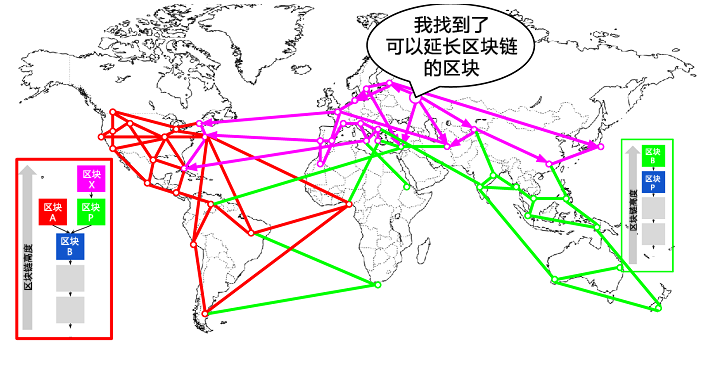
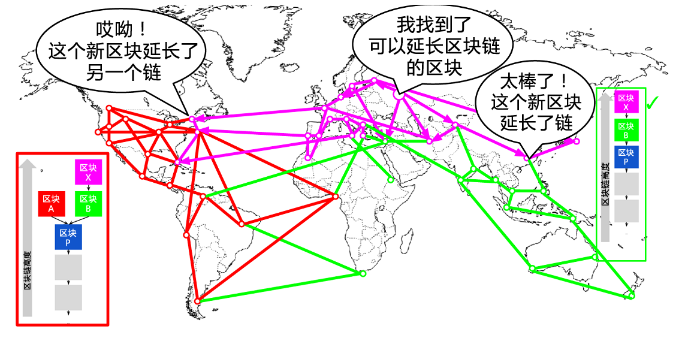

# 第8章 挖矿与共识

## 8.1 简介

挖矿是增加比特币货币供应的一个过程。挖矿同时还保护着比特币系统的安全，防止欺诈交易，避免“双重支付”，“双重支付”是指多次花费同一笔比特币。矿工们通过为比特币网络提供算力来换取获得比特币奖励的机会。

矿工们验证每笔新的交易并把它们记录在总帐簿上。每10分钟就会有一个新的区块被“挖掘”出来，每个区块里包含着从上一个区块产生到目前这段时间内发生的所有交易，这些交易被依次添加到区块链中。我们把包含在区块内且被添加到区块链上的交易称为“确认”交易，交易经过“确认”之后，新的拥有者才能够花费他在交易中得到的比特币。

矿工们在挖矿过程中会得到两种类型的奖励：创建新区块的新币奖励，以及区块中所含交易的交易费。为了得到这些奖励，矿工们争相完成一种基于加密哈希算法的数学难题，这些难题的答案包括在新区块中，作为矿工的计算工作量的证明，被称为”“工作量证明”。该算法的竞争的机制以及获胜者有权在区块链上进行交易记录的机制，这二者比特币安全的基石。

新比特币的生成过程被称为挖矿是因为它的奖励机制被设计为速度递减模式，类似于贵重金属的挖矿过程。比特币的货币是通过挖矿发行的，类似于中央银行通过印刷银行纸币来发行货币。矿工通过创造一个新区块得到的比特币数量大约每四年（或准确说是每隔210,000个块）减少一半。开始时为2009年1月每个区块奖励50个比特币，然后到2012年11月减半为每个区块奖励25个比特币。之后将在2016年的某个时刻再次减半为每个新区块奖励12.5个比特币。基于这个公式，比特币挖矿奖励以指数方式递减，直到2140年。届时所有的比特币（20,999,999,980）全部发行完毕。换句话说在2140年之后，不会再有新的比特币产生。

矿工们同时也会获取交易费。每笔交易都可能包含一笔交易费，交易费是每笔交易记录的输入和输出的差额。在挖矿过程中“挖出”新区块的矿工获胜者可以得到该区块中包含的所有交易“小费”。目前，这笔费用占矿工收入的0.5%或更少，大部分收益仍来自挖矿所得的比特币奖励。然而随着挖矿奖励的递减，以及每个区块中包含的交易数量增加，交易费在矿工收益中所占的比重将会逐渐增加。在2140年之后，所有的矿工收益都将由交易费构成。

“挖矿”这个词有一定的误导性。它容易引起对贵重金属采矿的的联想，从而使我们的注意力都集中在每个新区块产生的奖励上。尽管挖矿带来的奖励是一种激励，但它最主要的目的并不是奖励本身或者新币的产生。如果只把挖矿看作生产新币的过程，那你是把手段（激励措施）当成了目的。挖矿是一种将结算所去中心化的过程，每个结算所对处理的交易进行验证和结算。挖矿保护了比特币系统的安全，并且实现了在没有中心机构的情况下，也能使整个比特币网络达成共识。

挖矿这个发明使比特币变得很特别，这种去中心化的安全机制是点对点的电子货币的基础。铸造新币的奖励和交易费是一种激励机制，它可以调节矿工行为和网络安全，同时又完成了比特币的货币发行。

在本章中，我们先来审视比特币的货币发行机制，然后再来了解挖矿的最重要的功能：支撑比特币安全的去中心化的自发共识机制。

### 8.1.1 比特币经济学和货币创造

通过创造出新区块，比特币以一个确定的但不断减慢的速率被铸造出来。大约每十分钟产生一个新区块，每一个新区块都伴随着一定数量从无到有的全新比特币。每开采210,000个块，大约耗时4年，货币发行速率降低50%。在比特币运行的第一个四年中，每个区块创造出50个新比特币。

2012年11月，比特币的新发行速度降低到每区块25个比特币，并且预计会在2016年的某个时刻，在第420,000个区块被“挖掘”出来之后降低到12.5比特币/区块。在第13,230,000个区块（大概在2137年被挖出）之前，新币的发行速度会以指数形式进行64次“二等分”。到那时每区块发行比特币数量变为比特币的最小货币单位——1聪。最终，在经过1,344万个区块之后，所有的共2,099,999,997,690,000聪比特币将全部发行完毕。换句话说，到2140年左右，会存在接近2,100万比特币。在那之后，新的区块不再包含比特币奖励，矿工的收益全部来自交易费。图8-1展示了在发行速度不断降低的情况下，比特币总流通量与时间的关系。

在例8-1的代码展示中，我们计算了比特币的总发行量。

**例8-1 比特币发行总量的计算脚本**

```
# 初始的块奖励为50BTC
start_block_reward = 50
# 以10分钟为一个区块的间隔，210000个块共约4年时间
reward_interval = 210000

def max_money():
    # 50 BTC = 50 0000 0000 Satoshis
    current_reward = 50 * 10**8
    total = 0
    while current_reward > 0:
        total += reward_interval * current_reward
        current_reward /= 2
    return total

print "Total BTC to ever be created:", max_money(), "Satoshis"
```

例8-2显示了这个脚本的运行结果。

**例8-2 运行 max_money.py 脚本**

```
$ python max_money.py
Total BTC to ever be created: 2099999997690000 Satoshis
```

>  
<br> 图8-1 比特币货币供应速度随着时间发生几何级降低

总量有限并且发行速度递减创造了一种抗通胀的货币供应模式。法币可被中央银行无限制地印刷出来，而比特币永远不会因超额印发而出现通胀。

> ### 通货紧缩货币
> 最重要并且最有争议的一个结论是一种事先确定的发行速率递减的货币发行模式会导致货币通货紧缩（简称通缩）。通缩是一种由于货币的供应和需求不匹配导致的货币增值的现象。它与通胀相反，价格通缩意味着货币随着时间有越来越强的购买力。

> 许多经济学家提出通缩经济是一种无论如何都要避免的灾难型经济。因为在快速通缩时期，人们预期着商品价格会下跌，人们将会储存货币，避免花掉它。这种现象充斥了日本经济“失去的十年”，就是因为在需求坍塌之后导致了滞涨状态。

> 比特币专家们认为通缩本身并不坏。更确切地说，我们将通缩与需求坍塌联系在一起是因为过去出现的一个特例。在法币届，货币是有可能被无限制印刷出来的，除非遇到需求完全崩塌并且毫无发行货币意愿的情形，因此经济很难进入滞涨期。而比特币的通缩并不是需求坍塌引起的，它遵循一种预定且有节制的货币供应模型。

> 实际上，通缩货币会让卖家考虑到折现的影响，容易诱发过度的囤积本能，除非这部分折现率超过买家的囤积本能。因为买卖双方都有囤积的动机，这两种折现率会因为双方的囤积本能相互抵消，而达成一个平衡价格。因此即使在比特币价格贴现率为30%的情况下，大部分使用比特币的零售商并不会感受到花费比特币很困难，也能因此盈利。当然，比特币这种不是因经济快速衰退而引起的通缩，是否会引发其他问题，仍有待观察。

## 8.2 去中心化共识

在上一章中我们了解了区块链。可以将区块链看作一本记录所有交易的公开总帐簿（列表），比特币网络中的每个参与者都把它看作一本所有权的权威记录。

但在不考虑相信任何人的情况下，比特币网络中的所有参与者如何达成对任意一个所有权的共识呢？所有的传统支付系统都依赖于一个中心认证机构，依靠中心机构提供的结算服务来验证并处理所有的交易。比特币没有中心机构，几乎所有的完整节点都有一份公共总帐的备份，这份总帐可以被视为认证过的记录。区块链并不是由一个中心机构创造的，它是由比特币网络中的所有节点各自独立竞争完成的。换句话说比特币网络中的所有节点，依靠着节点间的不稳定的网络连接所传输的信息，最终得出同样的结果并维护了同一个公共总帐。这一章将介绍比特币网络不依靠中心机构而达成共识的机制。

中本聪的主要发明就是这种去中心化的自发共识机制。这种自发，是指没有经过明确选举或者没有固定达成的共识的时间。换句话说，共识是数以千计的独立节点遵守了简单的规则通过异步交互自发形成的产物。所有的比特币属性，包括货币、交易、支付以及不依靠中心机构和信任的安全模型等都是这个机制的衍生物。比特币的去中心化共识由所有网络节点的4种独立过程相互作用而产生：

▷ 每个全节点依据综合标准对每个交易进行独立验证
<br>▷ 通过完成工作量证明算法的验算，挖矿节点将交易记录独立打包进新区块，
<br>▷ 每个节点独立的对新区块进行校验并组装进区块链
<br>▷ 每个节点对区块链进行独立选择，在工作量证明机制下选择累计工作量最大的区块链

在接下来的几节中，我们将审视这些过程，了解它们之间如何相互作用并达成全网的自发共识，从而使任意节点组合出它自己的权威、可信、公开的总帐。

## 8.3 交易的独立校验

在第5章中，我们知道了钱包软件通过收集UTXO、提供正确的解锁脚本、构造支付给接收者的输出这一系列的方式来创建交易。产生的交易随后将被发送到比特币网络临近的节点，从而使得该交易能够在整个比特币网络中传播。

然而，在交易传递到临近的节点前，每一个收到交易的比特币节点将会首先验证该交易，这将确保只有有效的交易才会在网络中传播，而无效的交易将会在第一个节点处被废弃。

每一个节点在校验每一笔交易时，都需要对照一个长长的标准列表：
 
▷交易的语法和数据结构必须正确。
<br>▷输入与输出列表都不能为空。
<br>▷交易的字节大小是小于`MAX_BLOCK_SIZE`的。
<br>▷每一个输出值，以及总量，必须在规定值的范围内 （小于2,100万个币，大于0）。
<br>▷没有哈希等于0，N等于-1的输入（coinbase交易不应当被中继）。
<br>▷nLockTime是小于或等于`INT_MAX`的。
<br>▷交易的字节大小是大于或等于100的。
<br>▷交易中的签名数量应小于签名操作数量上限。
<br>▷解锁脚本（`scriptSig`）只能够将数字压入栈中，并且锁定脚本（`scriptPubkey`）必须要符合`isStandard`的格式 （该格式将会拒绝非标准交易）。
<br>▷池中或位于主分支区块中的一个匹配交易必须是存在的。
<br>▷对于每一个输入，如果引用的输出存在于池中任何的交易，该交易将被拒绝。
<br>▷对于每一个输入，在主分支和交易池中寻找引用的输出交易。如果输出交易缺少任何一个输入，该交易将成为一个孤立的交易。如果与其匹配的交易还没有出现在池中，那么将被加入到孤立交易池中。
<br>▷对于每一个输入，如果引用的输出交易是一个coinbase输出，该输入必须至少获得`COINBASE_MATURITY` (100)个确认。
<br>▷对于每一个输入，引用的输出是必须存在的，并且没有被花费。
<br>▷使用引用的输出交易获得输入值，并检查每一个输入值和总值是否在规定值的范围内 （小于2100万个币，大于0）。
<br>▷如果输入值的总和小于输出值的总和，交易将被中止。
<br>▷如果交易费用太低以至于无法进入一个空的区块，交易将被拒绝。
<br>▷每一个输入的解锁脚本必须依据相应输出的锁定脚本来验证。

这些条件能够在比特币标准客户端下的`AcceptToMemoryPool`、`CheckTransaction`和`CheckInputs`函数中获得更详细的阐述。请注意，这些条件会随着时间发生变化，为了处理新型拒绝服务攻击，有时候也为交易类型多样化而放宽规则。

在收到交易后，，每一个节点都会在全网广播前对这些交易进行校验，并以接收时的相应顺序，为有效的新交易建立一个池（交易池）。

## 8.4 挖矿节点

在比特币网络中，一些节点被称为专业节点矿工。第1章中，我们介绍了Jing，在中国上海的计算机工程专业学生，他就是一位矿工。Jing通过矿机挖矿获得比特币，矿机是专门设计用于挖比特币的计算机硬件系统。Jing的这台专业挖矿设备连接着一个运行完整比特币节点的服务器。与Jing不同，一些矿工是在没有完整节点的条件下进行挖矿，正如我们在“<a href="chapter08.html#8-11-2-%E7%9F%BF%E6%B1%A0">8.11.2 矿池</a>”一节中所述的。与其他任一完整节点相同，Jing的节点在比特币网络中进行接收和传播未确认交易记录。然而，Jing的节点也能够在新区块中整合这些交易记录。

同其他节点一样，Jing的节点时刻监听着传播到比特币网络的新区块。而这些新加入的区块对挖矿节点有着特殊的意义。矿工间的竞争以新区块的传播而结束，如同宣布谁是最后的赢家。对于矿工们来说，获得一个新区块意味着某个参与者赢了，而他们则输了这场竞争。然而，一轮竞争的结束也代表着下一轮竞争的开始。新区块并不仅仅是象征着竞赛结束的方格旗；它也是下一个区块竞赛的发令枪。

## 8.5 整合交易至区块

验证交易后，比特币节点会将这些交易添加到自己的内存池中。内存池也称作交易池，用来暂存尚未被加入到区块的交易记录。与其他节点一样，Jing的节点会收集、验证并中继新的交易。而与其他节点不同的是，Jing的节点会把这些交易整合到一个候选区块中。

让我们继续跟进，看下Alice从Bob咖啡店购买咖啡时产生的那个区块（参见“<a href="chapter02.html#2-1-2-%E4%B9%B0%E5%92%96%E5%95%A1">2.1.2 买咖啡</a>”）。Alice的交易在区块277,316。为了演示本章中提到的概念，我们假设这个区块是由Jing的挖矿系统挖出的，并且继续跟进Alice的交易，因为这个交易已经成为了新区块的一部分。

Jing的挖矿节点维护了一个区块链的本地副本，包含了自2009年比特币系统启动运行以来的全部区块。当Alice买咖啡的时候，Jing节点的区块链已经收集到了区块277,314，并继续监听着网络上的交易，在尝试挖掘新区块的同时，也监听着由其他节点发现的区块。当Jing的节点在挖矿时，它从比特币网络收到了区块277,315。这个区块的到来标志着终结了产出区块277,315竞赛，与此同时也是产出区块277,316竞赛的开始。

在上一个10分钟内，当Jing的节点正在寻找区块277,315的解的同时，它也在收集交易记录为下一个区块做准备。目前它已经收到了几百笔交易记录，并将它们放进了内存池。直到接收并验证区块277,315后，Jing的节点会检查内存池中的全部交易，并移除已经在区块277,315中出现过的交易记录，确保任何留在内存池中的交易都是未确认的，等待被记录到新区块中。

Jing的节点立刻构建一个新的空区块，做为区块277,316的候选区块。称作候选区块是因为它还没有包含有效的工作量证明，不是一个有效的区块，而只有在矿工成功找到一个工作量证明解之后，这个区块才生效。

### 8.5.1 交易块龄，矿工费和优先级

Jing的比特币节点需要为内存池中的每笔交易分配一个优先级，并选择较高优先级的交易记录来构建候选区块。交易的优先级是由交易输入所花费的UTXO的“块龄”决定，交易输入值高、“块龄”大的交易比那些新的、输入值小的交易拥有更高的优先级。如果区块中有足够的空间，高优先级的交易行为将不需要矿工费。

交易的优先级是通过输入值和输入的“块龄”乘积之和除以交易的总长度得到的：

```
Priority = Sum (Value of input * Input Age) / Transaction Size
```

在这个等式中，交易输入的值是由比特币单位“聪”（100万分之1个比特币）来表示的。UTXO的“块龄”是自该UTXO被记录到区块链为止所经历过的区块数，即这个UTXO在区块链中的深度。交易记录的大小由字节来表示。

一个交易想要成为“较高优先级”，需满足的条件：优先值大于57,600,000，相当于一个比特币（即100万聪），年龄为一天（144个区块），交易的大小为250个字节：

```
High Priority > 100,000,000 satoshis * 144 blocks / 250 bytes = 57,600,000
```

区块中用来存储交易的前50K字节是保留给较高优先级交易的。Jing的节点在填充这50K字节的时候，会优先考虑这些最高优先级的交易，不管它们是否包含了矿工费。这种机制使得高优先级交易即便是零矿工费，也可以优先被处理。

然后，Jing的挖矿节点会选出那些包含最小矿工费的交易，并按照“每千字节矿工费”进行排序，优先选择矿工费高的交易来填充剩下的区块，区块大小上限为`MAX_BLOCK_SIZE`。

如区块中仍有剩余空间，Jing的挖矿节点可以选择那些不含矿工费的交易。有些矿工会竭尽全力将那些不含矿工费的交易整合到区块中，而其他矿工也许会选择忽略这些交易。

在区块被填满后，内存池中的剩余交易会成为下一个区块的候选交易。因为这些交易还留在内存池中，所以随着新的区块被加到链上，这些交易输入时所引用UTXO的深度（即交易“块龄”）也会随着变大。由于交易的优先值取决于它交易输入的“块龄”，所以这个交易的优先值也就随之增长了。最后，一个零矿工费交易的优先值就有可能会满足高优先级的门槛，被免费地打包进区块。

比特币交易中没有过期、超时的概念，一笔交易现在有效，那么它就永远有效。然而，如果一笔交易只在全网广播了一次，那么它只会保存在一个挖矿节点的内存中。因为内存池是以未持久化的方式保存在挖矿节点存储器中的，所以一旦这个节点重新启动，内存池中的数据就会被完全擦除。而且，即便一笔有效交易被传播到了全网，如果它长时间未处理，它将从挖矿节点的内存池中消失。如果交易本应该在一段时间内被处理而实际没有，那么钱包软件应该重新发送交易或重新支付更高的矿工费。

现在，Jing的节点从内存池中整合到了全部的交易，新的候选区块包含有418笔交易，总的矿工费为0.09094925个比特币。你可以通过比特币核心客户端命令行来查看这个区块，如例8-3所示：

**例8-3 区块277,316**

```
{
    "hash" : "0000000000000001b6b9a13b095e96db41c4a928b97ef2d944a9b31b2cc7bdc4", 
    "confirmations" : 35561,
    "size" : 218629,
    "height" : 277316,
    "version" : 2,
    "merkleroot" :
"c91c008c26e50763e9f548bb8b2fc323735f73577effbc55502c51eb4cc7cf2e", 
    "tx":[
        "d5ada064c6417ca25c4308bd158c34b77e1c0eca2a73cda16c737e7424afba2f",
        "b268b45c59b39d759614757718b9918caf0ba9d97c56f3b91956ff877c503fbe",
        ... 417 more transactions ...
        ],
    "time" : 1388185914,
    "nonce" : 924591752,
    "bits" : "1903a30c",
    "difficulty" : 1180923195.25802612, 
    "chainwork" :
"000000000000000000000000000000000000000000000934695e92aaf53afa1a", 
    "previousblockhash" :
"0000000000000002a7bbd25a417c0374cc55261021e8a9ca74442b01284f0569", 
    "nextblockhash" :
"000000000000000010236c269dd6ed714dd5db39d36b33959079d78dfd431ba7"
}
```

### 8.5.2 创币交易
区块中的第一笔交易是笔特殊交易，称为创币交易或者coinbase交易。这个交易是由Jing的节点构造并用来奖励矿工们所做的贡献的。Jing的节点会创建“向Jing的地址支付25.09094928个比特币”这样一个交易，把生成交易的奖励发送到自己的钱包。Jing挖出区块获得的奖励金额是coinbase奖励（25个全新的比特币）和区块中全部交易矿工费的总和。如例8-4所示：

```
$ bitcoin-cli getrawtransaction
d5ada064c6417ca25c4308bd158c34b77e1c0eca2a73cda16c737e7424afba2f 1
    ```

**例8-4 创币交易**

```
{
    "hex" :
"01000000010000000000000000000000000000000000000000000000000000000000000000ffffffff0f03443b0403858402062f503253482fffffffff0110c08d9500000000232102aa970c592640d19de03ff6f329d6fd2eecb023263b9ba5d1b81c29b523da8b21ac00000000",
    "txid" : "d5ada064c6417ca25c4308bd158c34b77e1c0eca2a73cda16c737e7424afba2f", 
    "version" : 1,
    "locktime" : 0,
    "vin" : [
        {
            "coinbase" : "03443b0403858402062f503253482f",                  "sequence" : 4294967295
        } 
    ],
    "vout" : [ 
        {
            "value" : 25.09094928, 
            "n":0, "
            scriptPubKey" : {
                "asm" : "02aa970c592640d19de03ff6f329d6fd2eecb023263b9ba5d1b81c29b523da8b21OP_CHECKSIG",
                "hex" : "2102aa970c592640d19de03ff6f329d6fd2eecb023263b9ba5d1b81c29b523da8b21ac",
                "reqSigs" : 1, 
                "type" : "pubkey", 
                "addresses" : [
                    "1MxTkeEP2PmHSMze5tUZ1hAV3YTKu2Gh1N"
                ]
            }
        } 
    ],
    "blockhash" : 
"0000000000000001b6b9a13b095e96db41c4a928b97ef2d944a9b31b2cc7bdc4",
    "confirmations" : 35566, 
    "time" : 1388185914, 
    "blocktime" : 1388185914
}
```

与常规交易不同，创币交易没有输入，不消耗UTXO。它只包含一个被称作coinbase的输入，仅仅用来创建新的比特币。创币交易有一个输出，支付到这个矿工的比特币地址。创币交易的输出将这25.09094928个比特币发送到矿工的比特币地址，如本例所示的1MxTkeEP2PmHSMze5tUZ1hAV3YTKu2Gh1N。

### 8.5.3 Coinbase奖励与矿工费

为了构造创币交易，Jing的节点需要计算矿工费的总额，将这418个已添加到区块交易的输入和输出分别进行加总，然后用输入总额减去输出总额得到矿工费总额，公式如下：

```
 Total Fees = Sum(Inputs) - Sum(Outputs)
 ```

在区块277,316中，矿工费的总额是0.09094925个比特币。

紧接着，Jing的节点计算出这个新区块正确的奖励额。奖励额的计算是基于区块高度的，以每个区块50个比特币为开始，每产生210,000个区块减半一次。这个区块高度是277,316，所以正确的奖励额是25个比特币。

详细的计算过程可以参看比特币核心客户端中的GetBlockValue函数，如例8-5所示：

**例8-5 计算区块奖励—Function GetBlockValue, Bitcoin Core Client, main.cpp, line 1305**

```
int64_t GetBlockValue(int nHeight, int64_t nFees) 
{
    int64_t nSubsidy = 50 * COIN;
    int halvings = nHeight / Params().SubsidyHalvingInterval();
    
    // 如果右移的次数未定义，区块奖励强制为零
    if (halvings >= 64)
	        return nFees;
	        
    // Subsidy每210,000个区块减半一次，大概每4年发生一次
    nSubsidy >>= halvings; 
    
    return nSubsidy + nFees;
}
```

变量nSubsidy表示初始奖励额，值为`COIN`常量（100,000,000聪)与50的乘积，也就是说初始奖励额为50亿聪。

紧接着，这个函数用当前区块高度除以减半间隔(`SubsidyHalvingInterval`函数)得到减半次数（变量`halvings`）。每210,000个区块为一个减半间隔，对应本例中的区块277316，所以减半次数为1。

变量`halvings`最大值64，如果超出这个值，代码算得的奖励额为0，整个函数将只返回矿工费总额，作为奖励总额。

然后，这个函数会使用二进制右移操作将奖励额(变量`nSubsidy`)右移一位（等同与除以2），每一轮减半右移一次。在这个例子中，对于区块277,316只需要将值为50亿聪的奖励额右移一次，得到25亿聪，也就是25个比特币的奖励额。之所以采用二进制右移操作，是因为相比于整数或浮点数除法，右移操作的效率更高。

最后，将coinbase奖励额（变量`nSubsidy`）与矿工费(`nFee`)总额求和，并返回这个值。

### 8.5.4 创币交易的结构

经过计算，Jing的节点构造了一个创币交易，支付给自己25.09094928枚比特币。

如例8-4所示，创币交易的结构比较特殊，与一般交易输入需要指定一个先前的UTXO不同，它包含一个“coinbase“输入。在表5-3中，我们已经给出了交易输入的结构。现在让我们来比较一下常规交易输入与创币交易输入。表8-1给出了常规交易输入的结构，表8-2给出的是创币交易输入的结构。

**表8-1 “普通“交易输入的结构**

| Size | Field | Description |
| -- | -- | -- |
| 32 bytes| Transaction Hash | Pointer to the transaction containing the UTXO to be spent |
| 4 bytes | Output Index| The index number of the UTXO to be spent, first one is 0 |
|1-9 bytes (VarInt) | Unlocking-Script Size |Unlocking-Script length in bytes, to follow |
| Variable | Unlocking-Script |  A script that fulfills the conditions of the UTXO locking script.|
| 4 bytes | Sequence Number| Currently disabled Tx-replacement feature, set to 0xFFFFFFFF |

**表8-2 生成交易输入的结构**

| Size | Field | Description |
| -- | -- | -- |
|32 bytes | Transaction Hash| All bits are zero: Not a transaction hash reference |
| 4 bytes| Output Index | All bits are ones: 0xFFFFFFFF |
|1-9 bytes (VarInt) | Coinbase Data Size |Length of the coinbase data, from 2 to 100 bytes |
| Variable | Coinbase Data |Arbitrary data used for extra nonce and mining tags in v2 blocks, must begin with block height|
| 4 bytes | Sequence Number| Set to 0xFFFFFFFF |

在创币交易中，“交易哈希”字段32个字节全部填充0，“交易输出索引”字段全部填充0xFF(十进制的255)，这两个字段的值表示不引用UTXO。“解锁脚本”由coinbase数据代替，数据可以由矿工自定义。

### 8.5.5 Coinbase数据

创币交易不包含“解锁脚本“(又称作 `scriptSig`)字段，这个字段被coinbase数据替代，长度最小2字节，最大100字节。除了开始的几个字节外，矿工可以任意使用coinbase的其他部分，随意填充任何数据。

以创世块为例，中本聪在coinbase中填入了这样的数据“The Times 03/Jan/ 2009 Chancellor on brink of second bailout for banks“(泰晤士报 2009年1月3日 财政大臣将再次对银行施以援手)，表示对日期的证明，同时也表达了对银行系统的不信任。现在，矿工使用coinbase数据实现extra nonce功能，并嵌入字符串来标识挖出它的矿池，这部分内容会在后面的小节描述。coinbase前几个字节也曾是可以任意填写的，不过在后来的第34号比特币改进提议(BIP34)中规定了版本2的区块（版本字段为2的区块），这个区块的高度必须跟在脚本操作“push“之后，填充在coinbase字段的起始处。

我们以例8-4中的区块277,316为例，coinbase就是交易输入的“解锁脚本“（或scriptSig）字段，这个字段的十六进制值为03443b0403858402062f503253482f。下面让我们来解码这段数据。

第一个字节是03，脚本执行引擎执行这个指令将后面3个字节压入脚本栈(见表4-1)，紧接着的3个字节——0x443b04，是以小端格式(最低有效字节在先)编码的区块高度。翻转字节序得到0x043b44，表示为十进制是277,316。

紧接着的几个十六进制数（03858402062）用于编码extra nonce(参见"<a href="chapter08.html#8-11-1-%E9%9A%8F%E6%9C%BA%E5%80%BC%E5%8D%87%E4%BD%8D%E6%96%B9%E6%A1%88">8.11.1 随机值升位方案</a>")，或者一个随机值，从而求解一个适当的工作量证明。

coinbase数据结尾部分(2f503253482f)是ASCII编码字符 /P2SH/，表示挖出这个区块的挖矿节点支持BIP0016所定义的pay-to-script-hash(P2SH)改进方案。在P2SH功能引入到比特币的时候，曾经有过一场对P2SH不同实现方式的投票，候选者是BIP0016和BIP0017。支持BIP0016的矿工将/P2SH/放入coinbase数据中，支持BIP0017的矿工将 p2sh/CHV放入他们的coinbase数据中。最后，BIP0016在选举中胜出，直到现在依然有很多矿工在他们的coinbase中填入/P2SH/以表示支持这个功能。

例8-6使用了libbitcoin库（在56页“其他替代客户端、资料库、工具包”中提到）从创世块中提取coinbase数据，并显示出中本聪留下的信息。libbitcoin库中自带了一份创世块的静态拷贝，所以这段示例代码可以直接取自库中的创世块数据。

**例8-6 从创世区块中提取coinbase数据**

```
/*
  Display the genesis block message by Satoshi.
*/
#include <iostream>
#include <bitcoin/bitcoin.hpp>

int main() 
{
    // Create genesis block.
    bc::block_type block = bc::genesis_block();
    // Genesis block contains a single coinbase transaction.     assert(block.transactions.size() == 1);
    // Get first transaction in block (coinbase).
    const bc::transaction_type& coinbase_tx = block.transactions[0];
    // Coinbase tx has a single input.
    assert(coinbase_tx.inputs.size() == 1);
    const bc::transaction_input_type& coinbase_input = coinbase_tx.inputs[0]; 
    // Convert the input script to its raw format.
    const bc::data_chunk& raw_message = save_script(coinbase_input.script); 
    // Convert this to an std::string.
    std::string message;
    message.resize(raw_message.size());
    std::copy(raw_message.begin(), raw_message.end(), message.begin());
    // Display the genesis block message.
    std::cout << message << std::endl;
    return 0;
}
```

在例8-7中，我们使用GNU C++编译器编译源代码并运行得到的可执行文件

**例8-7 编译并运行satoshi-words示例代码**

```
$ # Compile the code
$ g++ -o satoshi-words satoshi-words.cpp $(pkg-config --cflags --libs libbitcoin) $ # Run the executable
$ ./satoshi-words
^D��<GS>^A^DEThe Times 03/Jan/2009 Chancellor on brink of second bailout for banks
```

## 8.6 构造区块头

为了构造区块头，挖矿节点需要填充六个字段，如表8-3中所示。

**表8-3 区块头的结构**

| Size | Field | Description |
| -- | -- | -- |
| 4 bytes | Version | A version number to track software/protocol upgrades |
| 32 bytes | Previous Block Hash|A reference to the hash of the previous (parent) block in the chain |
| 32 bytes | Merkle Root | A hash of the root of the merkle tree of this block’s transactions |
| 4 bytes | Timestamp| The approximate creation time of this block (seconds from Unix Epoch)|
|4 bytes| Difficulty Target | The proof-of-work algorithm difficulty target for this block |
| 4 bytes | Nonce | A counter used for the proof-of-work algorithm |

在区块277,316被挖出的时候，区块结构中用来表示版本号的字段值为2，长度为4字节，以小段格式编码值为0x20000000。接着，挖矿节点需要填充“前区块哈希”，在本例中，这个值为Jing的节点从网络上接收到的区块277,315的区块头哈希值，它是区块277316候选区块的父区块。区块277,315的区块头哈希值为：

```
0000000000000002a7bbd25a417c0374cc55261021e8a9ca74442b01284f0569
```

为了向区块头填充merkle根字段，要将全部的交易组成一个merkle树。创币交易作为区块中的首个交易，后将余下的418笔交易添至其后，这样区块中的交易一共有419笔。在164页，我们已经见到过“Merkle树”，树中必须有偶数个叶子节点，所以需要复制最后一个交易作为第420个节点，每个节点是对应交易的哈希值。这些交易的哈希值逐层地、成对地组合，直到最终组合并成一个根节点。merkle数的根节点将全部交易数据摘要为一个32字节长度的值，例8-3中merkel根的值如下：

```
c91c008c26e50763e9f548bb8b2fc323735f73577effbc55502c51eb4cc7cf2e
```

挖矿节点会继续添加一个4字节的时间戳，以Unix纪元时间编码，即自1970年1月1日0点到当下总共流逝的秒数。本例中的1388185914对应的时间是2013年12月27日，星期五，UTC/GMT。

接下来，节点需要填充难度目标值，为了使得该区块有效，这个字段定义了所需满足的工作量证明的难度。难度在区块中以“尾数-指数”的格式，编码并存储，这种格式称作“难度位”。这种编码的首字节表示指数，后面的3字节表示尾数(系数)。以区块277316为例，难度位的值为0x1903a30c，0x19是指数的十六进制格式，后半部0x03a30c是系数。这部分的概念在第195页的“难度目标与难度调整”和第194的“难度表示”有详细的解释。

最后一个字段是nonce，初始值为0。

区块头完成全部的字段填充后，挖矿就可以开始进行了。挖矿的目标是找到一个使区块头哈希值小于难度目标的nonce。挖矿节点通常需要尝试数十亿甚至数万亿个不同的nonce取值，直到找到一个满足条件的nonce值。

## 8.7 构建区块

既然Jing的节点已经构建了一个候选区块，那么就轮到Jing的矿机对这个新区块进行“挖掘”，求解工作量证明算法以使这个区块有效。从本书中我们已经学习了比特币系统中不同地方用到的哈希加密函数。比特币挖矿过程使用的是SHA256哈希函数。

用最简单的术语来说，挖矿就是重复计算区块头的哈希值，不断修改该参数，直到与哈希值匹配的一个过程。哈希函数的结果无法提前得知，也没有能得到一个特定哈希值的模式。哈希函数的这个特性意味着：得到哈希值的唯一方法是不断的尝试，每次随机修改输入，直到出现适当的哈希值。

### 8.7.1 工作量证明算法

哈希函数的输入数据的长度是任意的，将产生一个长度固定且绝不雷同的值，可将其视为输入的数字指纹。对于特定输入，哈希的结果每次都一样，任何实现相同哈希函数的人都可以计算和验证。一个加密哈希函数的主要特征就是不同的输入几乎不可能出现相同的数字指纹。因此，相对于随机选择输入，有意地选择输入去生成一个想要的哈希值几乎是不可能的。

无论输入的大小是多少，SHA256函数的输出的长度总是256bit。在例8-8中，我们将使用Python解释器来计算语句 "I am Satoshi Nakamoto" 的SHA256的哈希值。

**例8-8 SHA256示例**

```
$ python
Python 2.7.1
>>> import hashlib
>>> print hashlib.sha256("I am Satoshi Nakamoto").hexdigest() 5d7c7ba21cbbcd75d14800b100252d5b428e5b1213d27c385bc141ca6b47989e
```

Example 8-8 shows the result of calculating the hash of "I am Satoshi Nakamoto": `5d7c7ba21cbbcd75d14800b100252d5b428e5b1213d27c385bc141ca6b47989e`. This 256-bit number is the hash or digest of the phrase and depends on every part of the phrase. Adding a single letter, punctuation mark, or any other character will produce a different hash.

Now, if we change the phrase, we should expect to see completely different hashes. Let’s try that by adding a number to the end of our phrase, using the simple Python scripting in Example 8-9.

Example 8-9. SHA256 A script for generating many hashes by iterating on a nonce

```
# example of iterating a nonce in a hashing algorithm's input
import hashlib
text = "I am Satoshi Nakamoto"
# iterate nonce from 0 to 19
for nonce in xrange(20):
# add the nonce to the end of the text
input = text + str(nonce)
# calculate the SHA-256 hash of the input (text+nonce)
hash = hashlib.sha256(input).hexdigest() # show the input and hash result
print input, '=>', hash
```

执行这个脚本就能生成这些只是末尾数字不同的语句的哈希值。例8-10 中显示了我们只是增加了这个数字，却得到了非常不同的哈希值。

**例8-10 通过迭代 nonce 来生成不同哈希值的脚本的输出**

```
$ python hash_example.py

I am Satoshi Nakamoto0 => a80a81401765c8eddee25df36728d732...
I am Satoshi Nakamoto1 => f7bc9a6304a4647bb41241a677b5345f...
I am Satoshi Nakamoto2 => ea758a8134b115298a1583ffb80ae629...
I am Satoshi Nakamoto3 => bfa9779618ff072c903d773de30c99bd...
I am Satoshi Nakamoto4 => bce8564de9a83c18c31944a66bde992f...
I am Satoshi Nakamoto5 => eb362c3cf3479be0a97a20163589038e...
I am Satoshi Nakamoto6 => 4a2fd48e3be420d0d28e202360cfbaba...
I am Satoshi Nakamoto7 => 790b5a1349a5f2b909bf74d0d166b17a...
I am Satoshi Nakamoto8 => 702c45e5b15aa54b625d68dd947f1597...
I am Satoshi Nakamoto9 => 7007cf7dd40f5e933cd89fff5b791ff0...
I am Satoshi Nakamoto10 => c2f38c81992f4614206a21537bd634a...
I am Satoshi Nakamoto11 => 7045da6ed8a914690f087690e1e8d66...
I am Satoshi Nakamoto12 => 60f01db30c1a0d4cbce2b4b22e88b9b...
I am Satoshi Nakamoto13 => 0ebc56d59a34f5082aaef3d66b37a66...
I am Satoshi Nakamoto14 => 27ead1ca85da66981fd9da01a8c6816...
I am Satoshi Nakamoto15 => 394809fb809c5f83ce97ab554a2812c...
I am Satoshi Nakamoto16 => 8fa4992219df33f50834465d3047429...
I am Satoshi Nakamoto17 => dca9b8b4f8d8e1521fa4eaa46f4f0cd...
I am Satoshi Nakamoto18 => 9989a401b2a3a318b01e9ca9a22b0f3...
I am Satoshi Nakamoto19 => cda56022ecb5b67b2bc93a2d764e75f...
```

每个语句都生成了一个完全不同的哈希值。它们看起来是完全随机的，但你在任何计算机上用Python执行上面的脚本都能重现这些完全相同的哈希值。

类似这样在语句末尾的变化的数字叫做nonce。Nonce是用来改变加密函数输出的，在这个示例中改变了这个语句的SHA256指纹。

为了使这个哈希算法变得富有挑战，我们来设定一个具有任意性的目标：找到一个语句，使之哈希值的十六进制表示以0开头。幸运的是，这很容易！在例8-10中语句 "I am Satoshi Nakamoto13" 的哈希值是 `0ebc56d59a34f5082aaef3d66b37a661696c2b618e62432727216ba9531041a5`，刚好满足条件。我们得到它用了13次。用概率的角度来看，如果哈希函数的输出是平均分布的，我们可以期望每16次得到一个以0开头的哈希值（十六进制每一位数字为0到F）。从数字的角度来看，我们要找的是小于 0x1000000000000000000000000000000000000000000000000000000000000000的哈希值。我们称这个为目标阀值，我们的目的是找到一个小于这个目标的哈希值。如果我们减小这个目标值，那找到一个小于它的哈希值会越来越难。

简单打个比方，想象人们不断扔一对色子以得到小于一个特定点数的游戏。第一局，目标是12。只要你不扔出两个6，你就会赢。然后下一局目标为11。玩家只能扔10或更小的点数才能赢，不过也很简单。假如几局之后目标降低为了5。现在有一半机率以上扔出来的色子加起来点数会超过5，因此无效。随着目标越来越小，要想赢的话，扔色子的次数会指数级的上升。最终当目标为2时（最小可能点数），只有一个人平均扔36次或2%扔的次数中，他才能赢。

在例8-10中，成功的nonce为13，且这个结果能被所有人独立确认。任何人将13加到语句 "I am Satoshi Nakamoto" 后面再计算哈希值都能确认它比目标值要小。这个正确的结果同时也是工作量证明（Proof of Work），因为它证明我们的确花时间找到了这个nonce。验证这个哈希值只需要一次计算，而我们找到它却花了13次。如果目标值更小（难度更大），那我们需要多得多的哈希计算才能找到合适的nonce，但其他人验证它时只需要一次哈希计算。此外，知道目标值后，任何人都可以用统计学来估算其难度，因此就能知道找到这个nonce需要多少工作。

比特币的工作量证明和例8-10中的挑战非常类似。矿工用一些交易构建一个候选区块。接下来，这个矿工计算这个区块头信息的哈希值，看其是否小于当前目标值。如果这个哈希值不小于目标值，矿工就会修改这个nonce（通常将之加1）然后再试一次。按当前比特币系统的难度，矿工得试10^15次（10的15次方）才能找到一个合适的nonce使区块头信息哈希值足够小。

例8-11是一个简化很多的工作量证明算法的实现。

**例8-11 简化的工作量证明算法**

```
#!/usr/bin/env python
# example of proof-of-work algorithm

import hashlib
import time

max_nonce = 2 ** 32 # 4 billion

def proof_of_work(header, difficulty_bits):

    # calculate the difficulty target
    target = 2 ** (256-difficulty_bits) 
    
    for nonce in xrange(max_nonce):
        hash_result = hashlib.sha256(str(header)+str(nonce)).hexdigest() 
        
        # check if this is a valid result, below the target

        if long(hash_result, 16) < target:
            print "Success with nonce %d" % nonce 
            print "Hash is %s" % hash_result 
            return (hash_result,nonce)
            
    print "Failed after %d (max_nonce) tries" % nonce 
    return nonce
    
if __name__ == '__main__': 

    nonce = 0
    hash_result = ''
    
    # difficulty from 0 to 31 bits
    for difficulty_bits in xrange(32): 
    
        difficulty = 2 ** difficulty_bits
        print "Difficulty: %ld (%d bits)" % (difficulty, difficulty_bits) 
        
        print "Starting search..."
        
        # checkpoint the current time
        start_time = time.time()
        
        # make a new block which includes the hash from the previous block 
        # we fake a block of transactions - just a string
        new_block = 'test block with transactions' + hash_result
        
        # find a valid nonce for the new block
        (hash_result, nonce) = proof_of_work(new_block, difficulty_bits) 
        
        # checkpoint how long it took to find a result
        end_time = time.time()
        
        elapsed_time = end_time - start_time
        print "Elapsed Time: %.4f seconds" % elapsed_time 
        
        if elapsed_time > 0:
            
            # estimate the hashes per second
            hash_power = float(long(nonce)/elapsed_time)
            print "Hashing Power: %ld hashes per second" % hash_power
```

你可以任意调整难度值（按二进制bit数来设定，即哈希值开头多少个bit必须是0）。然后执行代码，看看在你的计算机上求解需要多久。在例8-12中，你可以看到该程序在一个普通笔记本电脑上的执行情况。

**例8-12 多种难度值的工作量证明算法的运行输出**

```
$ python proof-of-work-example.py*

Difficulty: 1 (0 bits)

[...]

Difficulty: 8 (3 bits)
Starting search...
Success with nonce 9
Hash is 1c1c105e65b47142f028a8f93ddf3dabb9260491bc64474738133ce5256cb3c1
Elapsed Time: 0.0004 seconds
Hashing Power: 25065 hashes per second
Difficulty: 16 (4 bits)
Starting search...
Success with nonce 25
Hash is 0f7becfd3bcd1a82e06663c97176add89e7cae0268de46f94e7e11bc3863e148
Elapsed Time: 0.0005 seconds
Hashing Power: 52507 hashes per second
Difficulty: 32 (5 bits)
Starting search...
Success with nonce 36
Hash is 029ae6e5004302a120630adcbb808452346ab1cf0b94c5189ba8bac1d47e7903
Elapsed Time: 0.0006 seconds
Hashing Power: 58164 hashes per second

[...]

Difficulty: 4194304 (22 bits)
Starting search...
Success with nonce 1759164
Hash is 0000008bb8f0e731f0496b8e530da984e85fb3cd2bd81882fe8ba3610b6cefc3
Elapsed Time: 13.3201 seconds
Hashing Power: 132068 hashes per second
Difficulty: 8388608 (23 bits)
Starting search...
Success with nonce 14214729
Hash is 000001408cf12dbd20fcba6372a223e098d58786c6ff93488a9f74f5df4df0a3
Elapsed Time: 110.1507 seconds
Hashing Power: 129048 hashes per second
Difficulty: 16777216 (24 bits)
Starting search...
Success with nonce 24586379
Hash is 0000002c3d6b370fccd699708d1b7cb4a94388595171366b944d68b2acce8b95
Elapsed Time: 195.2991 seconds
Hashing Power: 125890 hashes per second

[...]

Difficulty: 67108864 (26 bits)
Starting search...
Success with nonce 84561291
Hash is 0000001f0ea21e676b6dde5ad429b9d131a9f2b000802ab2f169cbca22b1e21a
Elapsed Time: 665.0949 seconds
Hashing Power: 127141 hashes per second
```

你可以看出，随着难度位一位一位地增加，查找正确结果的时间会呈指数级增长。如果你考虑整个256bit数字空间，每次要求多一个0，你就把哈希查找空间缩减了一半。在例8-12中，为寻找一个nonce使得哈希值开头的26位值为0，一共尝试了8千多万次。即使家用笔记本每秒可以达270,000多次哈希计算，这个查找依然需要6分钟。

在写这本书的时候，比特币网络要寻找区块头信息哈希值小于 000000000000004c296e6376db3a241271f43fd3f5de7ba18986e517a243baa7。可以看出，这个目标哈希值开头的0多了很多。这意味着可接受的哈希值范围大幅缩减，因而找到正确的哈希值更加困难。生成下一个区块需要网络每秒计算1.5 x 10<sup>17</sup>次哈希。这看起来像是不可能的任务，但幸运的是比特币网络已经拥有100PH每秒（petahashes per second, peta-为 10<sup>15</sup>）的处理能力，平均每10分钟就可以找到一个新区块。

### 8.7.2 难度表示

在例8-3中，我们在区块中看到难度目标，其被标为"难度位"或简称"bits"。在区块277,316中，它的值为 0x1903a30c。这个标记的值被存为系数/指数格式，前两位十六进制数字为幂，接下来得六位为系数。在这个区块里，0x19为幂，而0x03a30c 为系数。

计算难度目标的公式为：

```
 target = coefficient * 2^(8 * (exponent – 3))
 ```

由此公式及难度位的值 0x1903a30c，可得：

```
target = 0x03a30c * 2^(0x08 * (0x19 - 0x03))

=> target = 0x03a30c * 2^(0x08 * 0x16)

=> target = 0x03a30c * 2^0xB0 
```

按十进制计算为：

```
=> target = 238,348 * 2^176
=> target =
22,829,202,948,393,929,850,749,706,076,701,368,331,072,452,018,388,575,715,328
```

转化为十六进制后为：

```
=> target =0x0000000000000003A30C00000000000000000000000000000000000000000000
```

也就是说高度为277,316的有效区块的头信息哈希值是小于这个目标值的。这个数字的二进制表示中前60位都是0。在这个难度上，一个每秒可以处理1万亿个哈希计算的矿工（1 tera-hash per second 或 1 TH/sec）平均每8,496个区块才能找到一个正确结果，换句话说，平均每59天，才能为某一个区块找到正确的哈希值。

### 8.7.3 难度目标与难度调整

如前所述，目标决定了难度，进而影响求解工作量证明算法所需要的时间。那么问题来了：为什么这个难度值是可调整的？由谁来调整？如何调整？

比特币的区块平均每10分钟生成一个。这就是比特币的心跳，是货币发行速率和交易达成速度的基础。不仅是在短期内，而是在几十年内它都必须要保持恒定。在此期间，计算机性能将飞速提升。此外，参与挖矿的人和计算机也会不断变化。为了能让新区块的保持10分钟一个的产生速率，挖矿的难度必须根据这些变化进行调整。事实上，难度是一个动态的参数，会定期调整以达到每10分钟一个新区块的目标。简单地说，难度被设定在，无论挖矿能力如何，新区块产生速率都保持在10分钟一个。

那么，在一个完全去中心化的网络中，这样的调整是如何做到的呢？难度的调整是在每个完整节点中独立自动发生的。每2,016个区块中的所有节点都会调整难度。难度的调整公式是由最新2,016个区块的花费时长与20,160分钟（两周，即这些区块以10分钟一个速率所期望花费的时长）比较得出的。难度是根据实际时长与期望时长的比值进行相应调整的（或变难或变易）。简单来说，如果网络发现区块产生速率比10分钟要快时会增加难度。如果发现比10分钟慢时则降低难度。

这个公式可以总结为如下形式：

```
New Difficulty = Old Difficulty * (Actual Time of Last 2016 Blocks / 20160 minutes)
```

例8-13展示了比特币核心客户端中的难度调整代码。

**例8-13 工作量证明的难度调整 源文件 pow.cpp 第43行函数 GetNextWorkRequired()**

```
// Go back by what we want to be 14 days worth of blocks
const CBlockIndex* pindexFirst = pindexLast;
for (int i = 0; pindexFirst && i < Params().Interval()-1; i++)
    pindexFirst = pindexFirst->pprev;
assert(pindexFirst);
// Limit adjustment step
int64_t nActualTimespan = pindexLast->GetBlockTime() - pindexFirst->GetBlockTime(); LogPrintf(" nActualTimespan = %d before bounds\n", nActualTimespan);
if (nActualTimespan < Params().TargetTimespan()/4)
    nActualTimespan = Params().TargetTimespan()/4; 
if (nActualTimespan > Params().TargetTimespan()*4) 
    nActualTimespan = Params().TargetTimespan()*4;
    
// Retarget
uint256 bnNew;
uint256 bnOld;
bnNew.SetCompact(pindexLast->nBits);
bnOld = bnNew;
bnNew *= nActualTimespan;
bnNew /= Params().TargetTimespan();

if (bnNew > Params().ProofOfWorkLimit()) 
    bnNew = Params().ProofOfWorkLimit();
    ```

参数Interval(2,016区块)和TergetTimespan(1,209,600秒及两周) 的定义在文件chainparams.cpp中。

为了防止难度的变化过快，每个周期的调整幅度必须小于一个因子（值为4）。如果要调整的幅度大于4倍，则按4倍调整。由于在下一个2,016区块的周期不平衡的情况会继续存在，所以进一步的难度调整会在下一周期进行。因此平衡哈希计算能力和难度的巨大差异有可能需要花费几个2,016区块周期才会完成。

>  
<br>寻找一个比特币区块需要整个网络花费10分钟来处理，每发现2,016个区块时会根据前2,016个区块完成的时间对难度进行调整。

值得注意的是目标难度与交易的数量和金额无关。这意味着哈希算力的强弱，即让比特币更安全的电力投入量，与交易的数量完全无关。换句话说，当比特币的规模变得更大，使用它的人数更多时，即使哈希算力保持当前的水平，比特币的安全性也不会受到影响。哈希算力的增加表明更多的人为得到比特币回报而加入了挖矿队伍。只要为了回报，公平正当地从事挖矿的矿工群体保持足够的哈希算力，"接管"攻击就不会得逞，让比特币的安全无虞。

目标难度和挖矿电力消耗与将比特币兑换成现金以支付这些电力之间的关系密切相关。高性能挖矿系统就是要用当前硅芯片以最高效的方式将电力转化为哈希算力。挖矿市场的关键因素就是每度电转换为比特币后的价格。因为这决定着挖矿活动的营利性，也因此刺激着人们选择进入或退出挖矿市场。

## 8.8 成功构建区块

前面已经看到，Jing的节点创建了一个候选区块，准备拿它来挖矿。Jing有几个安装了ASIC（专用集成电路）的矿机，上面有成千上万个集成电路可以超高速地并行运行SHA256算法。这些定制的硬件通过USB连接到他的挖矿节点上。接下来，运行在Jing的桌面电脑上的挖矿节点将区块头信息传送给这些硬件，让它们以每秒亿万次的速度进行nonce测试。

在对区块277,316的挖矿工作开始大概11分钟后，这些硬件里的其中一个求得了解并发回挖矿节点。当把这个结果放进区块头时，nonce 4,215,469,401 就会产生一个区块哈希值：

```
0000000000000002a7bbd25a417c0374cc55261021e8a9ca74442b01284f0569
```

而这个值小于难度目标值：

```
0000000000000003A30C00000000000000000000000000000000000000000000
```

Jing的挖矿节点立刻将这个区块发给它的所有相邻节点。这些节点在接收并验证这个新区块后，也会继续传播此区块。当这个新区块在网络中扩散时，每个节点都会将它作为区块277,316加到自身节点的区块链副本中。当挖矿节点收到并验证了这个新区块后，它们会放弃之前对构建这个相同高度区块的计算，并立即开始计算区块链中下一个区块的工作。

下节将介绍节点进行区块验证、最长链选择、达成共识，并以此形成一个去中心化区块链的过程。

## 8.9 校验新区块

比特币共识机制的第三步是通过网络中的每个节点独立校验每个新区块。当新区块在网络中传播时，每一个节点在将它转发到其节点之前，会进行一系列的测试去验证它。这确保了只有有效的区块会在网络中传播。独立校验还确保了诚实的矿工生成的区块可以被纳入到区块链中，从而获得奖励。行为不诚实的矿工所产生的区块将被拒绝，这不但使他们失去了奖励，而且也浪费了本来可以去寻找工作量证明解的机会，因而导致其电费亏损。

当一个节点接收到一个新的区块，它将对照一个长长的标准清单对该区块进行验证，若没有通过验证，这个区块将被拒绝。这些标准可以在比特币核心客户端的CheckBlock函数和CheckBlockHead函数中获得，它包括：

▷ 区块的数据结构语法上有效
<br>▷ 区块头的哈希值小于目标难度（确认包含足够的工作量证明）
<br>▷ 区块时间戳早于验证时刻未来两个小时（允许时间错误）
<br>▷ 区块大小在长度限制之内
<br>▷ 第一个交易（且只有第一个）是coinbase交易
<br>▷ 使用检查清单验证区块内的交易并确保它们的有效性，本书177页
<br>▷ “交易的独立校验”一节已经讨论过这个清单。
 
每一个节点对每一个新区块的独立校验，确保了矿工无法欺诈。在前面的章节中，我们看到了矿工们如何去记录一笔交易，以获得在此区块中创造的新比特币和交易费。为什么矿工不为他们自己记录一笔交易去获得数以千计的比特币？这是因为每一个节点根据相同的规则对区块进行校验。一个无效的coinbase交易将使整个区块无效，这将导致该区块被拒绝，因此，该交易就不会成为总账的一部分。矿工们必须构建一个完美的区块，基于所有节点共享的规则，并且根据正确工作量证明的解决方案进行挖矿，他们要花费大量的电力挖矿才能做到这一点。如果他们作弊，所有的电力和努力都会浪费。这就是为什么独立校验是去中心化共识的重要组成部分。

## 8.10 区块链的组装与选择

比特币去中心化的共识机制的最后一步是将区块集合至有最大工作量证明的链中。一旦一个节点验证了一个新的区块，它将尝试将新的区块连接到到现存的区块链，将它们组装起来。

节点维护三种区块：第一种是连接到主链上的，第二种是从主链上产生分支的（备用链），最后一种是在已知链中没有找到已知父区块的。在验证过程中，一旦发现有不符合标准的地方，验证就会失败，这样区块会被节点拒绝，所以也不会加入到任何一条链中。

任何时候，主链都是累计了最多难度的区块链。在一般情况下，主链也是包含最多区块的那个链，除非有两个等长的链并且其中一个有更多的工作量证明。主链也会有一些分支，这些分支中的区块与主链上的区块互为“兄弟”区块。这些区块是有效的，但不是主链的一部分。 保留这些分支的目的是如果在未来的某个时刻它们中的一个延长了并在难度值上超过了主链，那么后续的区块就会引用它们。在“<a href="chapter08.html#8-10-1-%E5%8C%BA%E5%9D%97%E9%93%BE%E5%88%86%E5%8F%89">8.10.1 区块链分叉</a>”，我们将会看到在同样的区块高度，几乎同时挖出区块时，候选链是如何产生的。

当节点接收到新区块，它会尝试将这个区块插入到现有区块链中。节点会看一下这个区块的“previous block hash”字段，这个字段是该区块对其父区块的引用。同时，新的节点将尝试在已存在的区块链中找出这个父区块。大多数情况下，父区块是主块链的“顶点”，这就意味着这个新的区块延长了主链。举个例子，一个新的区块——区块277,316引用了它的父区块——区块277,315。大部分收到了区块277,316的节点将区块277,315作为主链的顶点，连接这个新区块并延长区块链。

有时候，新区块所延长的区块链并不是主链，这一点我们将在“<a href="chapter08.html#8-10-1-%E5%8C%BA%E5%9D%97%E9%93%BE%E5%88%86%E5%8F%89">8.10.1 区块链分叉</a>”中看到。在这种情况下，节点将新的区块添加到备用链，同时比较备用链与主链的难度。如果备用链比主链积累了更多的难度，节点将收敛于备用链，意味着节点将选择备用链作为其新的主链，而之前那个老的主链则成为了备用链。如果节点是一个矿工，它将开始构造新的区块，来延长这个更新更长的区块链。

如果节点收到了一个有效的区块，而在现有的区块链中却未找到它的父区块，那么这个区块被认为是“孤块”。孤块会被保存在孤块池中，直到它们的父区块被节点收到。一旦收到了父区块并且将其连接到现有区块链上，节点就会将孤块从孤块池中取出，并且连接到它的父区块，让它作为区块链的一部分。当两个区块在很短的时间间隔内被挖出来，节点有可能会以相反的顺序接收到它们，这个时候孤块现象就会出现。

选择了最大难度的区块链后，所有的节点最终在全网范围内达成共识。随着更多的工作量证明被添加到链中，链的暂时性差异最终会得到解决。挖矿节点通过“投票”来选择它们想要延长的区块链，当它们挖出一个新块并且延长了一个链，新块本身就代表它们的投票。

相互竞争的链之间是存在差异的，下节我们将看到节点是怎样通过独立选择最长难度链来解决这种差异的。

### 8.10.1 区块链分叉

因为区块链是去中心化的数据结构，所以不同副本之间不能总是保持一致。区块有可能在不同时间到达不同节点，导致节点有不同的区块链视角。解决的办法是，每一个节点总是选择并尝试延长代表累计了最大工作量证明的区块链，也就是最长的或最大累计难度的链。节点通过将记录在每个区块中的难度加总起来，得到建立这个链所要付出的工作量证明的总量。只要所有的节点选择最长累计难度的区块链，整个比特币网络最终会收敛到一致的状态。分叉即在不同区块链间发生的临时差异，当更多的区块添加到了某个分叉中，这个问题便会迎刃而解。

在下面的图例中，我们可以了解网络中发生分叉的过程。图例代表简单的全球比特币网络，在真实的情况下，比特币网络的拓扑结构不是基于地理位置组织起来的。相反，在同一个网络中相互连接的节点，可能在地理位置上相距遥远，我们采用基于地理的拓扑是为了更加简洁地描述分叉。在真实比特币网络里，节点间的距离按“跳”而不是按照真实位置来衡量。为了便于描述，不同的区块被标示为不同的颜色，传播这些区块的节点网络也被标上颜色。

在第一张图（图8-2）中，网络有一个统一的区块链视角，以蓝色区块为主链的“顶点”。

>  
<br>图8-2 形象化的区块链分叉事件——分叉之前

当有两个候选区块同时想要延长最长区块链时，分叉事件就会发生。正常情况下，分叉发生在两名矿工在较短的时间内，各自都算得了工作量证明解的时候。两个矿工在各自的候选区块一发现解，便立即传播自己的“获胜”区块到网络中，先是传播给邻近的节点而后传播到整个网络。每个收到有效区块的节点都会将其并入并延长区块链。如果该节点在随后又收到了另一个候选区块，而这个区块又拥有同样父区块，那么节点会将这个区块连接到候选链上。其结果是，一些节点收到了一个候选区块，而另一些节点收到了另一个候选区块，这时两个不同版本的区块链就出现了。

在图8-3中，我们看到两个矿工几乎同时挖到了两个不同的区块。这两个区块是顶点区块——蓝色区块的子区块，可以延长这个区块链。为了便于跟踪这个分叉事件，我们设定有一个被标记为红色的、来自加拿大的区块，还有一个被标记为绿色的、来自澳大利亚的区块。

>  
<br>图8-3 形象化的区块链分叉事件：同时发现两个区块

假设有这样一种情况，一个在加拿大的矿工发现了“红色”区块的工作量证明解，在“蓝色”的父区块上延长了块链。几乎同一时刻，一个澳大利亚的矿工找到了“绿色”区块的解，也延长了“蓝色”区块。那么现在我们就有了两个区块：一个是源于加拿大的“红色”区块；另一个是源于澳大利亚的“绿色”。这两个区块都是有效的，均包含有效的工作量证明解并延长同一个父区块。这个两个区块可能包含了几乎相同的交易，只是在交易的排序上有些许不同。

当这个两个区块传播时，一些节点首先收到“红色”区块，一些节点收到“绿色”区块。如图8-4所示，比特币网络上的节点对于区块链的顶点产生了分歧，一派以红色区块为顶点，而另一派以绿色区块为顶点。

>  
<br>图8-4 形象化的区块链分叉事件：两个区块的传播将网络分裂了

从那时起，比特币网络中邻近（网络拓扑上的邻近，而非地理上的）加拿大的节点会首先收到“红色”区块，并建立一个最大累计难度的区块，“红色”区块为这个链的最后一个区块（蓝色-红色），同时忽略晚一些到达的“绿色”区块。相比之下，离澳大利亚更近的节点会判定“绿色”区块胜出，并以它为最后一个区块来延长区块链（蓝色-绿色），忽略晚几秒到达的“红色”区块。那些首先收到“红色”区块的节点，会即刻以这个区块为父区块来产生新的候选区块，并尝试寻找这个候选区块的工作量证明解。同样地，接受“绿色”区块的节点会以这个区块为链的顶点开始生成新块，延长这个链。

分叉问题几乎总是在一个区块内就被解决了。网络中的一部分算力专注于“红色”区块为父区块，在其之上建立新的区块；另一部分算力则专注在“绿色”区块上。即便算力在这两个阵营中平均分配，也总有一个阵营抢在另一个阵营前发现工作量证明解并将其传播出去。在这个例子中我们可以打个比方，假如工作在“绿色”区块上的矿工找到了一个“粉色”区块延长了区块链(蓝色-绿色-粉色)，他们会立刻传播这个新区块，整个网络会都会认为这个区块是有效的，如图8-5所示。

>  
<br>图8-5 形象化的区块链分叉事件：新区块延长了分支

所有在上一轮选择“绿色”区块为胜出者的节点会直接将这条链延长一个区块。然而，那些选择“红色”区块为胜出者的节点现在会看到两个链：“蓝色-绿色-粉色”和“蓝色-红色”。如图8-6所示，这些节点会根据结果将“蓝色-绿色-粉色”这条链设置为主链，将“蓝色-红色”这条链设置为备用链。这些节点接纳了新的更长的链，被迫改变了原有对区块链的观点，这就叫做链的重新共识。因为“红”区块做为父区块已经不在最长链上，导致了他们的候选区块已经成为了“孤块”，所以现在任何原本想要在“蓝色-红色”链上延长区块链的矿工都会停下来。全网将“蓝色-绿色-粉色”这条链识别为主链，“粉色”区块为这条链的最后一个区块。全部矿工立刻将他们产生的候选区块的父区块切换为“粉色”，来延长“蓝色-绿色-粉色”这条链。

>  
<br>图8-6 形象化的区块链分叉事件：全网在最长链上重新共识

从理论上来说，两个区块的分叉是有可能的，这种情况发生在因先前分叉而相互对立起来的矿工，又几乎同时发现了两个不同区块的解。然而，这种情况发生的几率是很低的。单区块分叉每周都会发生，而双块分叉则非常罕见。

比特币将区块间隔设计为10分钟，是在更快速的交易确认和更低的分叉概率间作出的妥协。更短的区块产生间隔会让交易清算更快地完成，也会导致更加频繁地区块链分叉。与之相对地，更长的间隔会减少分叉数量，却会导致更长的清算时间。

## 8.11 挖矿和算力竞赛

比特币挖矿是一个极富竞争性的行业。自从比特币存在开始，每年比特币算力都成指数增长。一些年份的增长还体现出技术的变革，比如在2010年和2011年，很多矿工开始从使用CPU升级到使用GPU，进而使用FGPA（现场可编程门阵列）挖矿。在2013年，ASIC挖矿的引入，把SHA256算法直接固化在挖矿专用的硅芯片上，引起了算力的另一次巨大飞跃。一台采用这种芯片的矿机可以提供的算力，比2010年比特币网络的整体算力还要大。

下表表示了比特币网络开始运行后最初五年的总算力：

**2009 **
<br> 0.5 MH/秒–8 MH/秒 (16倍增长)

**2010 **
<br>8 MH/秒–116 GH/秒 (14,500倍增长)

**2011 **
<br> 16 GH/秒–9 TH/秒 (562倍增长) 

**2012 **
<br> 9 TH/秒–23 TH/秒 (2.5倍增长) 

**2013 **
<br> 23 TH/秒–10 PH/秒 (450倍增长)

**2014** 
<br> 10 PH/秒–150 PH/秒  到8月为止  (15倍增长) 

在图8-7的图表中，我们可以看到近两年里，矿业和比特币的成长引起了比特币网络算力的指数增长（每秒网络总算力）。

>  
<br>图8-7 近两年的总算力，G次hash/秒

随着比特币挖矿算力的爆炸性增长，与之匹配的难度也相应增长。图8-8中的相对难度值显示了当前难度与最小难度（第一个块的难度）的比例。

>  
<br>图8-8 近两年的比特币难度值

近两年，ASIC芯片变得更加密集，特征尺寸接近芯片制造业前沿的22纳米。挖矿的利润率驱动这个行业以比通用计算更快的速度发展。目前，ASIC制造商的目标是超越通用CPU芯片制造商，设计特征尺寸为16纳米的芯片。对比特币挖矿而言，已经没有更多飞跃的空间，因为这个行业已经触及了摩尔定律的最前沿。摩尔定律指出计算能力每18个月增加一倍。尽管如此，随着更高密度的芯片和数据中心的部署竞赛，网络算力继续保持同步的指数增长。现在的竞争已经不再是比较单一芯片的能力，而是一个矿场能塞进多少芯片，并处理好散热和供电问题。

### 8.11.1 随机值升位方案

2012年以来，比特币挖矿发展出一个解决区块头基本结构限制的方案。在比特币的早期，矿工可以通过遍历随机数(Nonce)获得符合要求的hash来挖出一个块。难度增长后，矿工经常在尝试了40亿个值后仍然没有出块。然而，这很容易通过读取块的时间戳并计算经过的时间来解决。因为时间戳是区块头的一部分，它的变化可以让矿工用不同的随机值再次遍历。当挖矿硬件的速度达到了4GH/秒，这种方法变得越来越困难，因为随机数的取值在一秒内就被用尽了。当出现ASIC矿机并很快达到了TH/秒的hash速率后，挖矿软件为了找到有效的块，需要更多的空间来储存nonce值。可以把时间戳延后一点，但将来如果把它移动得太远，会导致区块变为无效。区块头需要一个新的“差异性”的信息来源。解决方案是使用coinbase交易作为额外的随机值来源，因为coinbase脚本可以储存2-100字节的数据，矿工们开始使用这个空间作为额外随机值的来源，允许他们去探索一个大得多的区块头值范围来找到有效的块。这个coinbase交易包含在merkle树中，这意味着任何coinbase脚本的变化将导致Merkle根的变化。8个字节的额外随机数，加上4个字节的“标准”随机数，允许矿工每秒尝试296（8后面跟28个零）种可能性而无需修改时间戳。如果未来矿工可以尝试所有的可能性，他们还可以通过修改时间戳来解决。同样，coinbase脚本中也有更多额外的空间可以为将来随机数的扩展做准备。

### 8.11.2 矿池
在这个激烈竞争的环境中，个体矿工独立工作（也就是solo挖矿）没有一点机会。他们找到一个区块以抵消电力和硬件成本的可能性非常小，以至于可以称得上是赌博，就像是买彩票。就算是最快的消费型ASIC也不能和那些在巨大机房里拥有数万芯片并靠近水电站的商业矿场竞争。现在矿工们合作组成矿池，汇集数以千计参与者们的算力并分享奖励。通过参加矿池，矿工们得到整体回报的一小部分，但通常每天都能得到，因而减少了不确定性。

让我们来看一个具体的例子。假设一名矿工已经购买了算力共计6,000GH/S，或6TH/S的设备，在2014年8月，它的价值大约是1万美元。该设备运行功率为3千瓦（KW），每日耗电72度，每日平均成本7或8美元。以目前的比特币难度，该矿工平均每155天或5个月可能solo出一个块。如果这个矿工确实在这个时限内挖出一个区块，奖励25比特币，如果每个比特币价格约为600美元，可以得到15,000美元的收入。这可以覆盖整个时间周期内的设备和电力成本，还剩下大约3,000美元的净利润。然而，在5个月的时间周期内能否挖出一个块主要靠矿工的运气。他有可能在五个月中得到两个块从而赚到非常大的利润。或者，他可能10个月都找不到一个块，从而遭受经济损失。更糟的是，比特币的工作证明（POW）算法的难度可能在这段时间内显著上升，按照目前算力增长的速度，这意味着矿工在设备被下一代更有效率的矿机取代之前，最多有6个月的时间取得成果。如果这个矿工加入矿池，而不是等待5个月内可能出现一次的暴利，他每周能赚取大约500-700美元。矿池的常规收入能帮他随时间摊销硬件和电力的成本，并且不用承担巨大的风险。在7到9个月后，硬件仍然会过时，风险仍然很高，但在此期间的收入至少是定期的和可靠的。

矿池通过专用挖矿协议协调成百上千的矿工。个人矿工在建立矿池账号后，设置他们的矿机连接到矿池服务器。他们的挖矿设备在挖矿时保持和矿池服务器的连接，和其他矿工同步各自的工作。这样，矿池中的矿工分享挖矿任务，之后分享奖励。

成功出块的奖励支付到矿池的比特币地址，而不是单个矿工的。一旦奖励达到一个特定的阈值，矿池服务器便会定期支付奖励到矿工的比特币地址。通常情况下，矿池服务器会为提供矿池服务收取一个百分比的费用。

参加矿池的矿工把搜寻候选区块的工作量分割，并根据他们挖矿的贡献赚取“份额”。矿池为赚取“份额”设置了一个低难度的目标，通常比比特币网络难度低1000倍以上。当矿池中有人成功挖出一块，矿池获得奖励，并和所有矿工按照他们做出贡献的“份额”数的比例分配。

矿池对任何矿工开放，无论大小、专业或业余。一个矿池的参与者中，有人只有一台小矿机，而有些人有一车库高端挖矿硬件。有人只用几十度电挖矿，也有人会用一个数据中心消耗兆瓦级的电量。矿池如何衡量每个人的贡献，既能公平分配奖励，又避免作弊的可能？答案是在设置一个较低难度的前提下，使用比特币的工作量证明算法来衡量每个矿工的贡献。因此，即使是池中最小的矿工也经常能分得奖励，这足以激励他们为矿池做出贡献。通过设置一个较低的取得份额的难度，矿池可以计量出每个矿工完成的工作量。每当矿工发现一个小于矿池难度的区块头hash，就证明了它已经完成了寻找结果所需的hash计算。更重要的是，这些为取得份额贡献而做的工作，能以一个统计学上可衡量的方法，整体寻找一个比特币网络的目标散列值。成千上万的矿工尝试较小区间的hash值，最终可以找到符合比特币网络要求的结果。

让我们回到骰子游戏的比喻。如果骰子玩家的目标是扔骰子结果都小于4（整体网络难度），一个矿池可以设置一个更容易的目标，统计有多少次池中的玩家扔出的结果小于8。当池中的玩家扔出的结果小于8（矿池份额目标），他们得到份额，但他们没有赢得游戏，因为没有完成游戏目标（小于4）。但池中的玩家会更经常的达到较容易的矿池份额目标，规律地赚取他们的份额，尽管他们没有完成更难的赢得比赛的目标。

时不时地，池中的一个成员有可能会扔出一个小于4的结果，矿池获胜。然后，收益可以在池中玩家获得的份额基础上分配。尽管目标设置为8或更少并没有赢得游戏，但是这是一个衡量玩家们扔出的点数的公平方法，同时它偶尔会产生一个小于4的结果。

同样的，一个矿池会将矿池难度设置在保证一个单独的矿工能够频繁地找到一个符合矿池难度的区块头hash来赢取份额。时不时的，某次尝试会产生一个符合比特币网络目标的区块头hash，产生一个有效块，然后整个矿池获胜。

#### 8.11.2.1 托管矿池

大部分矿池是“托管的”，意思是有一个公司或者个人经营一个矿池服务器。矿池服务器的所有者叫矿池管理员，同时他从矿工的收入中收取一个百分比的费用。

矿池服务器运行专业软件以及协调池中矿工们活动的矿池采矿协议。矿池服务器同时也连接到一个或更多比特币完全节点并直接访问一个块链数据库的完整副本。这使得矿池服务器可以代替矿池中的矿工验证区块和交易，缓解他们运行一个完整节点的负担。对于池中的矿工，这是一个重要的考量，因为一个完整节点要求一个拥有最少15-20GB的永久储存空间（磁盘）和最少2GB内存（RAM）的专用计算机。此外，运行一个完整节点的比特币软件需要监控、维护和频繁升级。由于缺乏维护或资源导致的任何宕机都会伤害到矿工的利润。对于很多矿工来说，不需要跑一个完整节点就能采矿，也是加入托管矿池的一大好处。

矿工连接到矿池服务器使用一个采矿协议比如Stratum (STM)或者 GetBlockTemplate (GBT)。一个旧标准GetWork (GWK) 自从2012年底已经基本上过时了，因为它不支持在hash速度超过4GH/S时采矿。STM和GBT协议都创建包含候选区块头模板的区块模板。矿池服务器通过聚集交易，添加coinbase交易（和额外的随机值空间），计算MERKLE根，并连接到上一个块hash来建立一个候选区块。这个候选区块的头部作为模板分发给每个矿工。矿工用这个区块模板在低于比特币网络的难度下采矿，并发送成功的结果返回矿池服务器赚取份额。

#### 8.11.2.2 P2P矿池

托管矿池存在管理人作弊的可能，管理人可以利用矿池进行双重支付或使区块无效。（参见“8.12 共识攻击”） 此外，中心化的矿池服务器代表着单点故障。如果因为拒绝服务攻击服务器挂了或者被减慢，池中矿工就不能采矿。在2011年，为了解决由中心化造成的这些问题，提出和实施了一个新的矿池挖矿方法。P2Pool是一个点对点的矿池，没有中心管理人。

P2Pool通过将矿池服务器的功能去中心化，实现一个并行的类似区块链的系统，名叫份额链。一个份额链是一个难度低于比特币区块链的区块链系统。份额链允许池中矿工在一个去中心化的池中合作，以每30秒一个份额区块的速度在份额链上采矿，并获得份额。份额链上的区块记录了贡献工作的矿工的份额，并且继承了之前份额区块上的份额记录。当一个份额区块上还实现了比特币网络的难度目标时，它将被广播并包含到比特币的区块链上，并奖励所有已经在份额链区块中取得份额的池中矿工。本质上说，比起用一个矿池服务器记录矿工的份额和奖励，份额链允许所有矿工通过类似比特币区块链系统的去中心化的共识机制跟踪所有份额。

P2Pool采矿方式比在矿池中采矿要复杂的多，因为它要求矿工运行空间、内存、带宽充足的专用计算机来支持一个比特币的完整节点和P2Pool节点软件。P2Pool矿工连接他们的采矿硬件到本地P2Pool节点，它通过发送区块模板到矿机来模拟一个矿池服务器的功能。在P2Pool中，单独的矿工创建自己的候选区块，聚合交易，非常类似于solo矿工，但是他们在份额链上合作采矿。P2Pool是一种比单独挖矿有更细粒度收入优势的混合方法。但是不需要像托管矿池那样给管理人太多权力。

最近，在集中式矿池已经接近产生51%攻击的担忧下，P2Pool的份额增长显著。（参见参见“8.12 共识攻击”）P2Pool协议的进一步发展有望去除对完整节点的需要，这将使去中心化采矿更容易。

## 8.12 共识攻击

比特币的共识机制指的是，被矿工（或矿池）试图使用自己的算力实行欺骗或破坏的难度很大，至少理论上是这样。就像我们前面讲的，比特币的共识机制依赖于这样一个前提，那就是绝大多数的矿工，出于自己利益最大化的考虑，都会通过诚实地挖矿来维持整个比特币系统。然而，当一个或者一群拥有了整个系统中大量算力的矿工出现之后，他们就可以通过攻击比特币的共识机制来达到破坏比特币网络的安全性和可靠性的目的。

值得注意的是，共识攻击只能影响整个区块链未来的共识，或者说，最多能影响不久的过去几个区块的共识（最多影响过去10个块）。而且随着时间的推移，整个比特币块链被篡改的可能性越来越低。理论上，一个区块链分叉可以变得很长，但实际上，要想实现一个非常长的区块链分叉需要的算力非常非常大，随着整个比特币区块链逐渐增长，过去的区块基本可以认为是无法被分叉篡改的。同时，共识攻击也不会影响用户的私钥以及加密算法（ECDSA）。共识攻击也不能从其他的钱包那里偷到比特币、不签名地支付比特币、重新分配比特币、改变过去的交易或者改变比特币持有纪录。共识攻击能够造成的唯一影响是影响最近的区块（最多10个）并且通过拒绝服务来影响未来区块的生成。

共识攻击的一个典型场景就是“51%攻击”。想象这么一个场景，一群矿工控制了整个比特币网络51％的算力，他们联合起来打算攻击整个比特币系统。由于这群矿工可以生成绝大多数的块，他们就可以通过故意制造块链分叉来实现“双重支付”或者通过拒绝服务的方式来阻止特定的交易或者攻击特定的钱包地址。区块链分叉/双重支付攻击指的是攻击者通过不承认最近的某个交易，并在这个交易之前重构新的块，从而生成新的分叉，继而实现双重支付。有了充足算力的保证，一个攻击者可以一次性篡改最近的6个或者更多的区块，从而使得这些区块包含的本应无法篡改的交易消失。值得注意的是，双重支付只能在攻击者拥有的钱包所发生的交易上进行，因为只有钱包的拥有者才能生成一个合法的签名用于双重支付交易。攻击者只能在自己的交易上进行双重支付攻击，但当这笔交易对应的是不可逆转的购买行为的时候，这种攻击就是有利可图的。

让我们看一个“51%攻击”的实际案例吧。在第1章我们讲到，Alice 和 Bob 之间使用比特币完成了一杯咖啡的交易。咖啡店老板 Bob 愿意在 Alice 给自己的转账交易确认数为零的时候就向其提供咖啡，这是因为这种小额交易遭遇“51%攻击”的风险和顾客购物的即时性（Alice 能立即拿到咖啡）比起来，显得微不足道。这就和大部分的咖啡店对低于25美元的信用卡消费不会费时费力地向顾客索要签名是一样的，因为和顾客有可能撤销这笔信用卡支付的风险比起来，向用户索要信用卡签名的成本更高。相应的，使用比特币支付的大额交易被双重支付的风险就高得多了，因为买家（攻击者）可以通过在全网广播一个和真实交易的UTXO一样的伪造交易，以达到取消真实交易的目的。双重支付可以有两种方式：要么是在交易被确认之前，要么攻击者通过块链分叉来完成。进行51%攻击的人，可以取消在旧分叉上的交易记录，然后在新分叉上重新生成一个同样金额的交易，从而实现双重支付。

再举个例子：攻击者Mallory在Carol的画廊买了描绘伟大的中本聪的三联组画，Mallory通过转账价值25万美金的比特币与Carol进行交易。在等到一个而不是六个交易确认之后，Carol放心地将这幅组画包好，交给了Mallory。这时，Mallory的一个同伙，一个拥有大量算力的矿池的人Paul，在这笔交易写进区块链的时候，开始了51%攻击。首先，Paul利用自己矿池的算力重新计算包含这笔交易的块，并且在新块里将原来的交易替换成了另外一笔交易（比如直接转给了Mallory的另一个钱包而不是Carol的），从而实现了“双重支付”。这笔“双重支付”交易使用了跟原有交易一致的UTXO，但收款人被替换成了Mallory的钱包地址。然后，Paul利用矿池在伪造的块的基础上，又计算出一个更新的块，这样，包含这笔“双重支付”交易的块链比原有的块链高出了一个块。到此，高度更高的分叉区块链取代了原有的区块链，“双重支付”交易取代了原来给Carol的交易，Carol既没有收到价值25万美金的比特币，原本拥有的三幅价值连城的画也被Mallory白白拿走了。在整个过程中，Paul矿池里的其他矿工可能自始至终都没有觉察到这笔“双重支付”交易有什么异样，因为挖矿程序都是自动在运行，并且不会时时监控每一个区块中的每一笔交易。

为了避免这类攻击，售卖大宗商品的商家应该在交易得到全网的6个确认之后再交付商品。或者，商家应该使用第三方的多方签名的账户进行交易，并且也要等到交易账户获得全网多个确认之后再交付商品。一条交易的确认数越多，越难被攻击者通过51%攻击篡改。对于大宗商品的交易，即使在付款24小时之后再发货，对买卖双方来说使用比特币支付也是方便并且有效率的。而24小时之后，这笔交易的全网确认数将达到至少144个（能有效降低被51%攻击的可能性）。

共识攻击中除了“双重支付”攻击，还有一种攻击场景就是拒绝对某个特定的比特币地址提供服务。一个拥有了系统中绝大多数算力的攻击者，可以轻易地忽略某一笔特定的交易。如果这笔交易存在于另一个矿工所产生的区块中，该攻击者可以故意分叉，然后重新产生这个区块，并且把想忽略的交易从这个区块中移除。这种攻击造成的结果就是，只要这名攻击者拥有系统中的绝大多数算力，那么他就可以持续地干预某一个或某一批特定钱包地址产生的所有交易，从而达到拒绝为这些地址服务的目的。

需要注意的是，51%攻击并不是像它的命名里说的那样，攻击者需要至少51%的算力才能发起，实际上，即使其拥有不到51%的系统算力，依然可以尝试发起这种攻击。之所以命名为51％攻击，只是因为在攻击者的算力达到51%这个阈值的时候，其发起的攻击尝试几乎肯定会成功。本质上来看，共识攻击，就像是系统中所有矿工的算力被分成了两组，一组为诚实算力，一组为攻击者算力，两组人都在争先恐后地计算块链上的新块，只是攻击者算力算出来的是精心构造的、包含或者剔除了某些交易的块。因此，攻击者拥有的算力越少，在这场决逐中获胜的可能性就越小。从另一个角度讲，一个攻击者拥有的算力越多，其故意创造的分叉块链就可能越长，可能被篡改的最近的块或者或者受其控制的未来的块就会越多。一些安全研究组织利用统计模型得出的结论是，算力达到全网的30%就足以发动51%攻击了。

全网算力的急剧增长已经使得比特币系统不再可能被某一个矿工攻击，因为一个矿工已经不可能占据全网哪怕的1%算力。但是中心化控制的矿池则引入了矿池操作者出于利益而施行攻击的风险。矿池操作者控制了候选块的生成，同时也控制哪些交易会被放到新生成的块中。这样一来，矿池操作者就拥有了剔除特定交易或者双重支付的权力。如果这种权利被矿池操作者以微妙而有节制的方式滥用的话，那么矿池操作者就可以在不为人知的情况下发动共识攻击并获益。

但是，并不是所有的攻击者都是为了利益。一个可能的场景就是，攻击者仅仅是为了破坏整个比特币系统而发动攻击，而不是为了利益。这种意在破坏比特币系统的攻击者需要巨大的投入和精心的计划，因此可以想象，这种攻击很有可能来自政府资助的组织。同样的，这类攻击者或许也会购买矿机，运营矿池，通过滥用矿池操作者的上述权力来施行拒绝服务等共识攻击。但是，随着比特币网络的算力呈几何级数快速增长，上述这些理论上可行的攻击场景，实际操作起来已经越来越困难。近期比特币系统的一些升级，比如旨在进一步将挖矿控制去中心化的P2Pool挖矿协议，也都正在让这些理论上可行的攻击变得越来越困难。

毫无疑问，一次严重的共识攻击事件势必会降低人们对比特币系统的信心，进而可能导致比特币价格的跳水。然而，比特币系统和相关软件也一直在持续改进，所以比特币社区也势必会对任何一次共识攻击快速做出响应，以使整个比特币系统比以往更加稳健和可靠。

